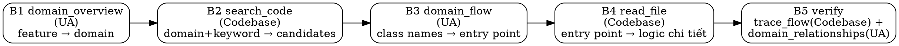

# Codebase Explorer

## Quy tắc cốt lõi (reflex)

> **UA-first khi trace code.** Thứ tự nguồn BẮT BUỘC:
> 1. **UA + kinh nghiệm** (agent-memory, knowledge-snapshot) — LUÔN trước. UA là bản đồ node (class/func/domain/flow/quan hệ/entry-point), KHÔNG chứa logic → dùng để trace/định vị.
> 2. **Codebase Memory** — hỗ trợ, vào SAU: extract logic trong thân hàm tại node UA đã định vị.
> 3. **grep** — fallback cuối.
>
> Lỗi Codebase Memory MCP ≠ UA không khả dụng: lỗi một cái → vẫn thử cái kia, KHÔNG fallback grep cả hai.
>
> Chỉ tuyên "localized" SAU khi đã thấy `{{ tools.domain_overview }}` — không skip UA như quyết định a-priori.

## 1. Mục tiêu

- Trả lời câu hỏi: **"Yêu cầu này chạm vào những phần code nào?"** ở mức module, service, file, symbol.
- Xây dựng bức tranh high-level về kiến trúc code liên quan tới REQUIREMENT để hỗ trợ:
  - `architecture-reviewer`
  - OpenSpec / propose
  - Ước lượng effort và rủi ro

Skill này chỉ tập trung vào **khảo sát và ghi nhận bối cảnh code**, không thay đổi code và không đề xuất giải pháp chi tiết.

---

## 2. Khi nào dùng

Dùng `codebase-explorer` khi:

- `/task` Pha 1 với input `HAS_TICKET` hoặc requirement đã tương đối rõ
- Nhánh ideation khi cần hiểu codebase hiện tại đang xử lý domain/use case nào
- Trước khi chạy:
  - `architecture-reviewer`
  - OpenSpec `/opsx:propose`

### Định tuyến UA-first

UA là bản đồ node (class/func/domain/flow/quan hệ/entry-point) — **không chứa logic**, dùng để trace/định vị TRƯỚC. Codebase Memory hỗ trợ SAU: extract logic trong thân hàm tại node UA đã định vị, và đọc code.

- **Mọi câu hỏi domain / business flow / entry point / ranh giới async (Kafka/gRPC) / quan hệ / blast-radius kiến trúc** → **UA trước, không điều kiện**: `{{ tools.domain_overview }}`, `{{ tools.domain_flow }}`, `{{ tools.domain_relationships }}`.
- **Đã có node UA cụ thể, cần đọc logic trong 1 hàm** → **Codebase Memory**: `{{ tools.search_code }}`, `{{ tools.get_symbol }}`, `{{ tools.read_file }}` để extract logic + đọc code. `{{ tools.trace_flow }}`/`{{ tools.find_blast_radius }}` chỉ xác nhận code-fact nội-service, KHÔNG định hình kiến trúc.

Chi tiết Cue Cards (CUE → ROUTINE → REWARD) và bảng năng lực đầy đủ: xem [references/altitude-routing.md](references/altitude-routing.md).

### Cổng độ phức tạp (Adaptive)

`{{ tools.domain_overview }}` là **bước đầu vô điều kiện** cho mọi task flow nghiệp vụ end-to-end, cross-module/cross-service, hoặc nghi async/event-driven (Kafka/gRPC/queue) — không có nhánh "task localized → bỏ qua UA top-down" được quyết định trước khi thấy map. Chỉ sau khi `{{ tools.domain_overview }}` xác nhận task thực sự đơn-symbol/đơn-file mới đi thẳng Codebase (`{{ tools.search_code }}` → `{{ tools.get_symbol }}`).

Ghi nhánh đã chọn + lý do (1 dòng) vào `{{ platform.framework_root }}/knowledge/active/AGENT_TRANSPARENCY.md`.

> Trước khi chạy Golden Path, kiểm tra trạng thái công cụ (xem **Bước 3** / `{{ tools.code_status }}` + tính khả dụng của UA) để quyết định degrade theo **Degradation**.

### Golden Path (5 bước handoff — mỗi bước seed cho bước sau)

1. **Định vị bối cảnh** — `{{ tools.domain_overview }}` (UA): từ tên feature/requirement → ra **tên domain**.
2. **Tìm diện rộng** — `{{ tools.search_code }}` / `{{ tools.list_symbols }}` (Codebase): từ domain+keyword → **danh sách class/method + file** ứng viên.
3. **Chiết xuất luồng** — `{{ tools.domain_flow }}` (UA): từ domain + class names → **entry point** (REST/gRPC/Kafka) + các step.
4. **Đọc mã** — `{{ tools.get_symbol }}` / `{{ tools.read_file }}` (Codebase): đọc logic chi tiết (lib, error-handling, threading).
5. **Verify liên kết** — `{{ tools.trace_flow }}` (Codebase) + `{{ tools.domain_relationships }}` (UA): bịt lỗ hổng interface→nhiều impl, điểm đứt async.

Liên kết chặt nằm ở B2↔B3 (Codebase tìm *cái gì tồn tại*, UA giải thích *nối nhau ra sao qua async*) và B5 (hai tool cross-check).

### Degradation (degrade mềm + ghi confidence)

- **UA vắng** (plugin chưa cài / `domain-graph.json` thiếu / UA MCP không chạy / op `domain_*` không resolve): bỏ bước 1, 3 (top-down), chạy Codebase-only (2, 4, 5 một phần). Ghi: "Thiếu domain map — rủi ro sót liên kết async, confidence ↓".
- **Graph Codebase stale/thiếu**: gợi ý `/understand` rebuild; tạm dùng UA + grep/read. Ghi confidence ↓.
- **Lỗi Codebase Memory MCP (`code_status` fail / project-not-found) ≠ UA không khả dụng** — thử UA độc lập, KHÔNG fallback grep cả hai.
- **Thiếu cả hai**: fallback grep/read; confidence THẤP; khuyến nghị index trước.

Luôn chạy được — không block. Không bịa kết quả cho tool không khả dụng.

### Source attribution

Ghi vào `AGENT_TRANSPARENCY.md` một dòng định tính (không ép số %): nguồn nào đóng góp gì — ví dụ *"Domain & flow async: từ UA; class/method, code logic, static trace: từ Codebase"*.

---

## Khi nào KHÔNG sử dụng

- Khi cần khám phá DB schema, constraint, trigger (→ db-explorer).
- Khi cần review kiến trúc, phát hiện xung đột, đánh giá rủi ro (→ architecture-reviewer).
- Khi cần sinh spec kỹ thuật chi tiết (→ openspec-propose).
- Khi chưa có REQUIREMENT.md chuẩn hoá — chạy requirement-analyst trước.
- Khi chỉ cần viết tài liệu mà không cần khám phá code (→ document-writer).

---

## 3. Input

- `{{ platform.framework_root }}/knowledge/active/REQUIREMENT.md`
- (Tuỳ chọn) `{{ platform.framework_root }}/knowledge/active/EXPLORE_CONTEXT.md`
- `{{ platform.framework_root }}/knowledge/long-term/knowledge-snapshot.md` (nếu có)
- Trạng thái tool:
  - Codebase Memory có khả dụng không
  - Repo có sử dụng Understand-Anything không
  - Graph UA đã được build trước đó chưa và còn tin cậy không

---

## 4. Output

Cập nhật `{{ platform.framework_root }}/knowledge/active/EXPLORE_CONTEXT.md` với section
`Kiến trúc code hiện tại (codebase-explorer)` — format đầy đủ + quy tắc identifier:
xem [references/altitude-routing.md § Output format đầy đủ](references/altitude-routing.md#output-format-đầy-đủ-explore_context-section).

Chỉ ghi những gì cần để skill khác hiểu bối cảnh. Không dump toàn bộ call graph hoặc copy nguyên nội dung file.

---

## 5. Công cụ — Pre-resolved Tools

Các tool đã được resolve tại thời điểm `maika init` — agent gọi trực tiếp, không cần runtime lookup.
`{{ tools.code_status }}` **luôn gọi đầu tiên** để kiểm tra index health/freshness. Danh sách operations
đầy đủ (`search_code`, `get_symbol`, `read_file`, `get_dependencies`, `trace_flow`, `find_blast_radius`):
xem [references/altitude-routing.md § Operations đầy đủ](references/altitude-routing.md#operations-đầy-đủ-codebase-memory).

> [!NOTE]
> Nếu tool không khả dụng (MCP chưa setup hoặc index chưa build),
> agent phải ghi hạn chế và hạ Độ tin cậy tương ứng.
> Không được bịa kết quả cho tool không khả dụng.

---

## 6. Quy trình

### Bước 1 — Chuẩn bị từ REQUIREMENT

Đọc `{{ platform.framework_root }}/knowledge/active/REQUIREMENT.md`, trích use case chính,
entity/khái niệm chính, hành động chính liên quan tới code. Dùng các mục này làm từ khoá truy vấn.

### Bước 2 — Xác định phạm vi codebase

Khoanh vùng module/service liên quan (monorepo: dựa tên thư mục/`knowledge-snapshot.md`; single
service: ưu tiên `src`/`app`/`domain`). Phân loại rõ Synchronous (API) hay Background
(Worker/Kafka/Job) để skill sau check Topology. Ghi phạm vi vào `EXPLORE_CONTEXT.md`.

### Bước 3 — Kiểm tra trạng thái công cụ

Gọi `{{ tools.code_status }}` kiểm tra provider (available + đủ mới không). OK → nguồn chính
(Bước 4). Không available → ghi hạn chế vào AGENT_TRANSPARENCY, dùng provider tiếp theo với
confidence thấp hơn. Không mặc định yêu cầu rebuild graph/index cho mọi task.

### Bước 4 — Khảo sát codebase (sau khi UA đã định vị node)

Bước này chạy **sau** B1/B3 (UA định vị domain + entry point) — Codebase Memory extract logic tại node đã định vị, không thay UA định hình kiến trúc.

Dùng abstract operations để:

- `{{ tools.search_code }}(keyword)` → tìm module/file/class liên quan đến REQUIREMENT
- `{{ tools.get_symbol }}(id)` → xem metadata component
- `{{ tools.read_file }}(id)` → **đọc code thực tế** để verify logic
- `{{ tools.get_dependencies }}(id)` → hiểu dependency
- `{{ tools.trace_flow }}(id)` → trace flow từ entry point

Nếu cần câu hỏi open-ended, fallback sang `/understand-chat`.

### Bước 5 — Khảo sát bổ sung (nếu cần)

Dùng provider bổ sung để:

- Xác nhận entry point cụ thể
- Tìm file, symbol, call site chính
- Làm rõ phần implementation
- Tìm impact area chi tiết hơn

UA luôn là điểm bắt đầu cho câu hỏi domain/business flow (Golden Path B1/B3). Codebase Memory chỉ follow-up để đọc logic — leo thang lại UA khi luồng đứt ở ranh giới async hoặc cần quan hệ/blast-radius kiến trúc.

### Bước 6 — Cross-check: Code thủ công + DB cross-reference

#### 6a — Đọc code thủ công (tuỳ chọn)

Nếu cần, đọc nhanh code ở vài file/symbol quan trọng để xác nhận use case, rẽ nhánh logic chính,
flag/toggle, adapter/integration chính. Chỉ đọc phần cần thiết, không đọc toàn bộ codebase.

#### 6b — DB cross-reference (BẮT BUỘC khi code chạm data layer)

Khi Bước 4–5 phát hiện code chạm tới config tables, transaction metadata, hoặc state management
(Factory/Repository/DAO đọc bảng config, Entity map sang bảng transaction, Enum resolve từ DB,
Adapter gọi external service dựa trên config DB) → Agent **PHẢI** gọi `db-explorer` hoặc
`{{ tools.db_query }}` trực tiếp để verify data thực tế trước khi ghi kết luận gap vào EXPLORE_CONTEXT.
Không kết luận gap chỉ từ code nếu gap đó có thể được verify bằng DB.

Checklist trigger đầy đủ + xử lý khi không kết nối được DB: xem
[references/altitude-routing.md § Bước 6b](references/altitude-routing.md#bước-6b--db-cross-reference-chi-tiết).

### Bước 7 — Ghi vào EXPLORE_CONTEXT

Cập nhật section `Kiến trúc code hiện tại (codebase-explorer)` theo format chuẩn.

Nếu có khác biệt giữa KG và Codebase Memory:

- Ghi rõ điểm chưa nhất quán
- Đánh dấu cần kiểm tra sâu hơn
- Hạ độ tin cậy nếu cần

> [!IMPORTANT]
> Ghi kèm `identifier` (node_id hoặc file path) cho mỗi entry point, service, adapter quan trọng để các skill downstream có thể gọi `{{ tools.read_file }}(identifier)` trực tiếp.

### Bước 8 — Cập nhật AGENT_TRANSPARENCY

Đánh dấu đã dùng `codebase-explorer` + provider/operations đã gọi + confidence level vào
`{{ platform.framework_root }}/knowledge/active/AGENT_TRANSPARENCY.md`. Checklist operations đầy đủ:
xem [references/altitude-routing.md § Bước 8](references/altitude-routing.md#bước-8--agent_transparency-checklist-đầy-đủ).

---

## 7. Lưu ý

- Giữ nội dung generic, không encode domain cụ thể.
- Không tự động chạy re-index hoặc thao tác nặng trên repo; chỉ gợi ý user khi cần.
- Với mọi truy vấn flow/cross-service, KHÔNG bỏ qua UA — đây là nguồn định hình kiến trúc, không phải lựa chọn tuỳ ý. Với truy vấn cần đọc logic trong hàm, không bỏ qua Codebase Memory. Không thay structured provider bằng grep chỉ vì nhanh.
- Ưu tiên `{{ tools.read_file }}` để đọc code thay vì mở file thủ công — giúp giữ context gọn và có identifier tracking.
- Skill này chỉ khám phá và ghi nhận codebase cho requirement hiện tại.
- Mọi đề xuất thay đổi kiến trúc hay implement chi tiết thuộc về `architecture-reviewer` và OpenSpec.
- Chi tiết Cue Cards, bảng năng lực, ví dụ altitude routing: [references/altitude-routing.md](references/altitude-routing.md).

---

## Gotchas

- **[G1] Provider phải sẵn sàng trước**: Luôn gọi `{{ tools.code_status }}` trước khi dùng operation khác. Nếu chưa sẵn sàng, gợi ý user setup (index, onboard, v.v.).
- **[G2] Identifier consistency**: Dùng cùng loại identifier (node_id hoặc file path) xuyên suốt phiên. Đoán identifier sẽ gây lỗi.
- **[G3] Provider lag**: Nếu user vừa edit code, provider có thể chưa cập nhật (<5s delay). Khi kết quả cũ cho file mới sửa, yêu cầu provider refresh.
- **[G4] Null operations**: Khi provider không hỗ trợ operation (mapping = null), không được suy luận kết quả. Ghi hạn chế rõ ràng.
