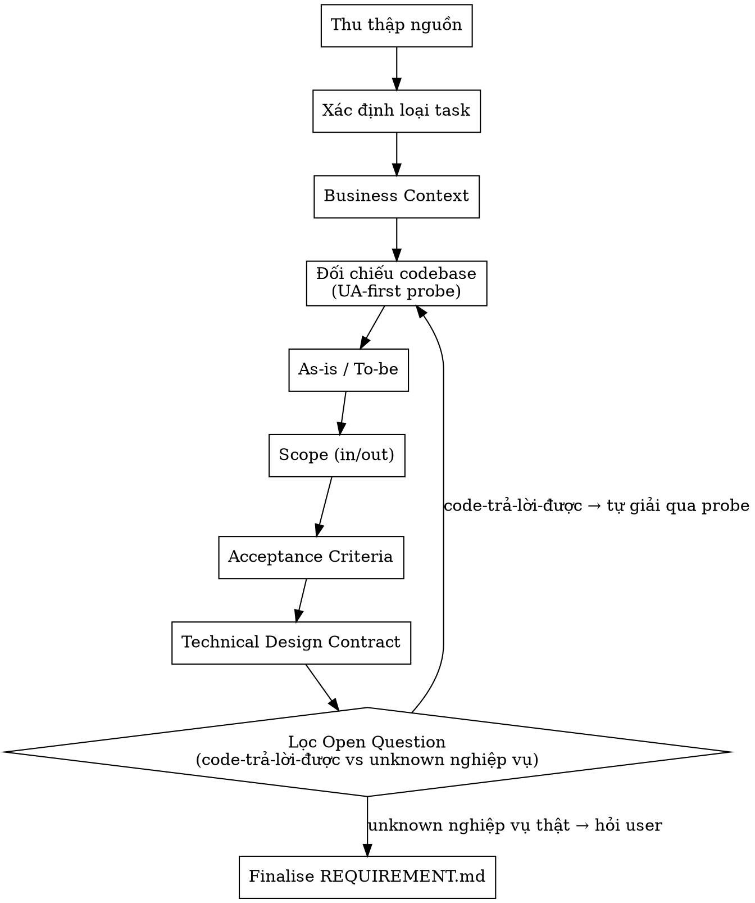

# Requirement Analyst — Chuẩn hoá REQUIREMENT từ ticket + tài liệu

## Quy tắc cốt lõi (reflex)

> **UA-first khi trace code.** Thứ tự nguồn BẮT BUỘC:
> 1. **UA + kinh nghiệm** (agent-memory, knowledge-snapshot) — LUÔN trước. UA là bản đồ node (class/func/domain/flow/quan hệ/entry-point), KHÔNG chứa logic → dùng để trace/định vị.
> 2. **Codebase Memory** — hỗ trợ, vào SAU: extract logic trong thân hàm tại node UA đã định vị.
> 3. **grep** — fallback cuối.
>
> Trước khi hỏi user: câu hỏi code-trả-lời-được → tự giải bằng UA-first probe (Bước "Đối chiếu codebase"); chỉ unknown nghiệp vụ thật mới hỏi.

## 1. Mục tiêu

Biến một yêu cầu rời rạc (ticket + tài liệu + trao đổi miệng) thành `REQUIREMENT.md` chuẩn hoá, để:

- Mọi người (BA, dev, QA, architect) **cùng hiểu một bức tranh**.
- Các skill sau (db-explorer, codebase-explorer, architecture-reviewer, OpenSpec) có thể làm việc mà không phải đọc lại toàn bộ ticket/tài liệu gốc.
- Giảm mơ hồ, tránh scope creep, làm rõ tiêu chí “xong”.

`REQUIREMENT.md` phải thể hiện tối thiểu:

- Bối cảnh và động lực rõ ràng.
- As-is / To-be tách bạch.
- Phạm vi (in-scope) và ngoài phạm vi (out-of-scope).
- Acceptance Criteria có thể kiểm tra.
- Loại task được gán đúng: `feature | fixbug | changerequest | refactor`.

---

## 2. Khi nào dùng

Kích hoạt `requirement-analyst` khi:

- Workflow `/task` đang ở Pha 1 với input loại **HAS_TICKET** (ví dụ: Jira, Azure Boards, Linear, v.v.).
- User yêu cầu trực tiếp: “Hãy chuẩn hoá requirement từ ticket này”, “Giúp anh/chị viết lại yêu cầu cho rõ ràng”.
- Đã có một số tài liệu rời rạc (wiki, spec, ghi chú) nhưng **chưa có REQUIREMENT.md chuẩn** cho task.

Không dùng skill này để:

- Viết spec kỹ thuật chi tiết (đó thuộc OpenSpec `/opsx:propose`).
- Đánh giá kiến trúc sâu (đó thuộc `architecture-reviewer`).

---

## Khi nào KHÔNG sử dụng

- Khi ý tưởng còn thô, chưa thành ticket rõ ràng (→ openspec-explore).
- Khi cần extract từ wiki/Confluence dài nhiều trang (→ spec-extract).
- Khi cần review kiến trúc hoặc đánh giá rủi ro (→ architecture-reviewer).
- Khi cần sinh spec kỹ thuật chi tiết (→ openspec-propose).

---

## 3. Input

Nguồn thông tin mà skill có thể dùng:

- **Ticket**:
  - Tiêu đề, mô tả, Acceptance Criteria (nếu có).
  - Comment, attachment, liên kết tới tài liệu khác.
  - Loại ticket (story, task, bug, change…), trạng thái, priority (để tham khảo, không nhất thiết phải map 1-1).
- **Tài liệu liên kết (tuỳ chọn)**:
  - Wiki, BRS, SRS, tech spec, design note… được link từ ticket.
  - Nếu tài liệu lớn, có thể cần `spec-extract` hỗ trợ tóm tắt có cấu trúc.
- **Trao đổi trong chat với user**:
  - Giải thích thêm, quyết định mới chưa được cập nhật vào ticket.

Skill **không tự ý bịa thêm requirement** nếu không có trong nguồn trên; mọi suy luận đều phải được đánh dấu là giả định.

---

## 4. Output

File chuẩn:

- `{{ platform.framework_root }}/knowledge/active/REQUIREMENT.md` (hoặc biến thể gắn với ID ticket tuỳ convention repo).

Cấu trúc tối thiểu:

- **Metadata task**:
  - Key/ID ticket, title, loại, trạng thái (optional), liên kết tài liệu chính.
- **Business context & động lực**:
  - Ai gặp vấn đề, vấn đề gì, tại sao phải giải quyết, done nghĩa là gì.
- **As-is / To-be**:
  - Hành vi hiện tại vs hành vi mong muốn.
- **Scope**:
  - In-scope.
  - Out-of-scope.
- **Acceptance Criteria**:
  - Dạng checklist, mỗi mục mô tả behaviour có thể quan sát/test.
- **Technical Design Contract (Đầu ra cho Client)**:
  - Định nghĩa rõ giao thức, endpoint, format (REST/gRPC/Kafka).
  - Schema đầu vào (Request/Message) và đầu ra (Response/Event).
  - Các thiết kế này phải tuân thủ kiến trúc hệ thống hiện tại.
- **Giả định (assumptions)**:
  - Điều đang được coi là đúng nhưng chưa xác nhận.
- **Vấn đề yêu cầu (requirement issues / open questions)**:
  - Mơ hồ, xung đột, thiếu thông tin cần làm rõ.
- (Tuỳ chọn) **Ghi chú từ ticket**:
  - Các đoạn text quan trọng từ ticket gốc để truy vết.

---

## 5. Quy trình chi tiết

### Bước 1 — Thu thập nguồn

1. Đọc toàn bộ nội dung ticket:
   - Không chỉ Summary; đọc Description, comment quan trọng, linked issues.
2. Mở tất cả link tài liệu chính (wiki/spec…) xuất hiện trong ticket.
3. Nếu có tài liệu lớn/chung mà chưa được tóm tắt:
   - Kích hoạt skill `spec-extract` để trích ra phần liên quan và dùng kết quả đó làm nền cho REQUIREMENT.
4. **Codebase** (qua UA-first probe, Bước 4): nguồn bổ sung — đối chiếu flow/use-case với hệ thống thực tế trước khi viết As-is hoặc ghi Open Question.
5. Ghi lại trong `{{ platform.framework_root }}/knowledge/active/AGENT_TRANSPARENCY.md` là đã đọc những nguồn nào.

---

### Bước 2 — Xác định loại task

Dựa vào nội dung ticket + tài liệu:

- `feature`:
  - Yêu cầu hành vi mới / luồng mới / màn hình mới chưa tồn tại.
- `fixbug`:
  - Hành vi thực tế của hệ thống **sai so với kỳ vọng** được mô tả (spec, AC, business rule).
- `changerequest`:
  - Hành vi hiện tại **đúng** theo thiết kế ban đầu, nhưng business muốn **thay đổi cách hoạt động**.
- `refactor`:
  - Tập trung vào nợ kỹ thuật, cải thiện cấu trúc, tối ưu, **không được phép đổi behaviour quan sát được**.

Nếu loại task không rõ ràng:

- Ghi tạm loại suy đoán (ví dụ: `type: changerequest?`).
- Thêm note “cần xác nhận với BA/PO”.
- Không cố “nắn” requirement chỉ để khớp một loại.

---

### Bước 3 — Viết Business Context & Mục tiêu

Trả lời rõ các câu hỏi, rồi viết lại thành 1–3 đoạn ngắn:

- Ai gặp vấn đề? (vai trò người dùng, hệ thống, đối tác…)
- Vấn đề hiện tại là gì? (triệu chứng, pain point, rủi ro…)
- Tại sao phải giải quyết bây giờ? (impact business, compliance, vận hành…)
- Done nghĩa là gì? (trạng thái thành công nhìn từ góc business, không phải góc code)

Ngôn ngữ:

- Ngắn gọn, trung lập, tránh buzzword.
- Không lẫn chi tiết kỹ thuật sâu (DB/table/method) vào phần context.

---

### Bước 4 — Đối chiếu codebase (UA-first reconnaissance probe)

Trước khi viết As-is và trước khi ghi BẤT KỲ Open Question nào, chạy **probe nhẹ** (KHÔNG
gọi full `codebase-explorer` — tránh phụ thuộc vòng với pre_condition REQUIREMENT.md):

1. `{{ tools.domain_overview }}` → luồng/use-case này có domain tương ứng trong hệ thống không?
2. `{{ tools.domain_flow }}` → nếu có, entry point (REST/gRPC/Kafka) + các step hiện tại.

Kết quả nuôi As-is/To-be:
- **Có trong code** → As-is = flow thực đã implement (kèm UA identifier); To-be = delta.
- **Chưa có** → ghi rõ "luồng chưa tồn tại trong codebase → feature mới".

Probe vắng UA → ghi hạn chế vào AGENT_TRANSPARENCY, hạ Độ tin cậy As-is; không bịa.

---

### Bước 5 — As-is / To-be

1. **As-is**:
   - Mô tả hành vi/flow hiện tại của hệ thống hoặc quy trình.
   - Dựa trên:
     - Ticket (mô tả bug, flow hiện tại).
     - Tài liệu hiện trạng (nếu có).
   - Nên dùng ví dụ cụ thể: input → hệ thống làm gì → output / state.

2. **To-be**:
   - Mô tả hành vi/flow mong muốn sau khi thực hiện task.
   - Tập trung vào **behaviour quan sát được**, không phải implementation chi tiết.

Nguyên tắc:

- Luôn tách As-is và To-be thành hai phần riêng biệt, không trộn.
- Tránh các câu dạng “hệ thống phải tốt hơn / tối ưu hơn” nếu không kèm tiêu chí đo được.
- Nếu To-be chưa rõ, ghi vào phần “Vấn đề yêu cầu” để làm rõ thêm.

---

### Bước 6 — Phạm vi (Scope)

1. **In-scope**:
   - Liệt kê:
     - Màn hình / API / job / event / module mà requirement cho phép đụng tới.
     - Dữ liệu hoặc báo cáo sẽ bị ảnh hưởng trực tiếp.
2. **Out-of-scope**:
   - Liệt kê rõ ràng:
     - Thành phần liên quan nhưng **không xử lý trong task này** (ví dụ: integration A, báo cáo B, mô-đun C…).

Vai trò:

- Out-of-scope là công cụ chống scope creep.
- Nếu có điểm không chắc chắn:
  - Ghi nghi vấn vào Out-of-scope với tag “cần confirm”.
  - Đồng thời thêm vào “Vấn đề yêu cầu”.

---

### Bước 7 — Acceptance Criteria (AC)

1. Thu thập AC từ:

   - Mục AC trong ticket (nếu có).
   - Mô tả mong đợi trong tài liệu hoặc comment.

2. Chuẩn hoá mỗi AC thành **checklist có thể test**:

   - Điều kiện đầu vào / bối cảnh (pre-condition).
   - Hành vi hệ thống (step/behaviour).
   - Kết quả quan sát được:
     - UI hiển thị gì.
     - API trả gì.
     - Data/ trạng thái thay đổi thế nào.

3. Nếu AC trong ticket mơ hồ:

   - Viết lại phiên bản rõ ràng hơn trong phần AC chuẩn hoá.
   - Giữ nguyên AC gốc (nếu cần) trong section “Ghi chú từ ticket” để trace.

4. Không thêm AC mới vượt ngoài scope đã xác định nếu không có cơ sở từ ticket/tài liệu; nếu suy luận, phải đánh dấu rõ là “gợi ý” và khuyến nghị user xác nhận.

---

### Bước 8 — Technical Design Contract (Đầu ra cho Client)

1. Thiết kế rõ ràng hợp đồng giao tiếp (interface contract) mà client sẽ sử dụng:
   - **Giao thức**: Chọn REST, gRPC, hoặc Kafka tuỳ theo kiến trúc.
   - **Endpoint/Topic**: Xác định định dạng URL hoặc Kafka Topic tuân theo convention của hệ thống.
2. Mô tả dữ liệu:
   - **Request/Message**: Các trường dữ liệu đầu vào bắt buộc/tuỳ chọn.
   - **Response/Event**: Cấu trúc dữ liệu trả về, bao gồm các mã lỗi (error codes) đặc thù.
3. Đồng bộ kiến trúc:
   - Contract đề xuất phải tuân thủ kiến trúc hiện có.
   - Đọc `conventions.yaml` (section `design_patterns`, `upstream_constraints`) và `knowledge-snapshot.md` để xác định các pattern/framework bắt buộc của hệ thống.
   - Nếu `conventions.yaml` chưa có hoặc status ≠ approved → ghi giả định vào section "Giả định", không tự bịa pattern.

---

### Bước 9 — Giả định & Vấn đề yêu cầu

1. **Giả định (Assumptions)**:

   - Mọi điều agent đang coi là đúng nhưng **không thấy stated rõ** trong ticket/tài liệu.
   - Ví dụ:
     - “Không có hệ thống bên thứ ba nào phụ thuộc vào API này.”
     - “Volume dữ liệu ở mức vừa, không cần tối ưu đặc biệt cho hiệu năng.”

2. **Vấn đề yêu cầu (Requirement Issues / Open Questions)**:

   > [!IMPORTANT]
   > **Bộ lọc trước khi hỏi user.** Phân loại mỗi câu:
   > - **Code-trả-lời-được** (entry point? race/lock xử lý ra sao? flow đã tồn tại? approve/reject
   >   hiện làm gì?) → PHẢI giải qua UA-first probe (Bước 4), KHÔNG đưa vào Open Question. Câu trả
   >   lời đi vào As-is / Technical Design Contract.
   > - **Unknown nghiệp vụ thật** (SLA? business rule? ai duyệt? ưu tiên?) → mới ghi Open Question cho user.

   - Mơ hồ (ví dụ: “nhanh hơn” nhưng không có SLA).
   - Xung đột (ví dụ: 2 tài liệu mô tả behaviour khác nhau).
   - Thiếu case (ví dụ: chưa nói gì về lỗi mạng, retry, giới hạn…).

3. Nếu số lượng issue critical quá nhiều:

   - Ghi rõ mức độ rủi ro (ví dụ: “Yêu cầu hiện tại chưa đủ rõ để sang bước architecture/implementation.”).
   - Đề nghị dừng pipeline và yêu cầu BA/PO làm rõ trước khi tiếp.

---

### Bước 10 — Finalise REQUIREMENT.md

1. Đảm bảo `REQUIREMENT.md` đầy đủ các section tối thiểu:
   - Metadata.
   - Business context & động lực.
   - As-is / To-be.
   - Scope.
   - AC.
   - Technical Design Contract.
   - Giả định.
   - Vấn đề yêu cầu.
2. Dọn ngôn ngữ:
   - Loại bỏ lặp lại, giữ câu ngắn, rõ, tránh slang nội bộ.
3. Nếu có nhiều nguồn (nhiều ticket, nhiều tài liệu), ghi rõ **nguồn chính** và **nguồn tham chiếu**.

---

## 6. Cập nhật AGENT_TRANSPARENCY

Trong `{{ platform.framework_root }}/knowledge/active/AGENT_TRANSPARENCY.md`:

- Đánh dấu:
  - `[x] REQUIREMENT.md`
  - `[x] requirement-analyst`
  - Nguồn đã đọc:
    - `[x] Ticket`
    - `[x] Tài liệu liên kết` (nếu có)
- Nếu còn lỗ hổng nghiêm trọng:
  - Ghi rõ trong mục “Cảnh báo”, ví dụ:
    - “Requirement chưa xác định rõ To-be cho luồng X.”
    - “Chưa rõ tác động tới hệ thống Y.”
- Đánh giá độ tin cậy chung cho REQUIREMENT hiện tại:
  - CAO / TRUNG BÌNH / THẤP, kèm 1–2 câu giải thích.
  
---

## Gotchas

- **[G1] CRLF/LF line endings**: REQUIREMENT.md được tạo trên Windows có thể dùng CRLF. Agent phải normalize khi parse — regex pattern `\r\n` sẽ fail nếu chỉ match `\n`.
- **[G2] Template skeleton detection**: Regex kiểm tra "file trống hay template" có thể miss custom skeleton nếu user đã sửa header. Luôn check cả `## Acceptance Criteria` section — nếu section đó trống thì coi như chưa có REQUIREMENT thực.
- **[G3] Confluence markdown conversion**: Khi extract từ Confluence, macro `{panel}`, `{expand}`, `{status}` sẽ bị mất hoặc biến thành text rác. Luôn đọc raw content trước, clean markup sau.
- **[G4] Multi-ticket REQUIREMENT**: Nếu user paste nhiều ticket vào 1 phiên, agent PHẢI tạo REQUIREMENT riêng cho mỗi ticket hoặc hỏi user chọn 1. Không gộp.
