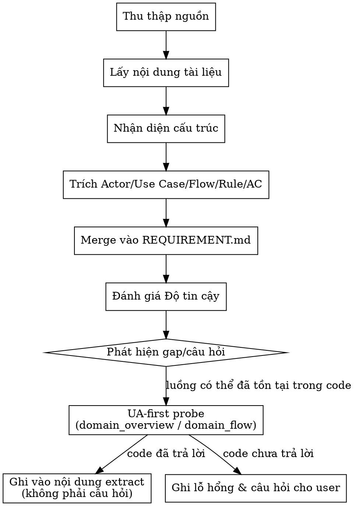

# Spec Extract — Tài liệu → REQUIREMENT

## Quy tắc cốt lõi (reflex)

> **UA-first khi trace code.** Thứ tự nguồn BẮT BUỘC:
> 1. **UA + kinh nghiệm** (agent-memory, knowledge-snapshot) — LUÔN trước. UA là bản đồ node (class/func/domain/flow/quan hệ/entry-point), KHÔNG chứa logic → dùng để trace/định vị.
> 2. **Codebase Memory** — hỗ trợ, vào SAU: extract logic trong thân hàm tại node UA đã định vị.
> 3. **grep** — fallback cuối.
>
> Khi tài liệu mô tả luồng đã/đang tồn tại: UA-first probe verify trong code TRƯỚC khi ghi gap hoặc hỏi user.

## 1. Mục tiêu

- Biến 1 (hoặc nhiều) tài liệu dạng tự do (wiki, Confluence, PRD, SRS, ghi chú…) thành **khối yêu cầu có cấu trúc** trong `{{ platform.framework_root }}/knowledge/active/REQUIREMENT.md`.
- Không copy-paste nguyên văn, mà rút ra và chuẩn hoá thành:
  - Tác nhân (actor), use case, mục tiêu.
  - Luồng chính và luồng lỗi ở mức business.
  - Quy tắc nghiệp vụ (business rules).
  - Acceptance Criteria (nếu có thể).
  - Ràng buộc phi chức năng (non-functional constraints).
- Đánh giá **Độ tin cậy** của tài liệu (CAO/TRUNG BÌNH/THẤP) và chỉ rõ lỗ hổng.

Skill này tập trung **đọc – hiểu – tóm tắt có cấu trúc**, không thay thế `requirement-analyst` mà bổ sung cho nó.

---

## 2. Khi nào dùng

Dùng `spec-extract` khi:

- `/task` Pha 1 với input kiểu `HAS_DOC_ONLY` (có tài liệu, chưa có ticket rõ ràng).
- `/task` Pha 1 với input `HAS_JIRA` nhưng ticket có kèm link tới:
  - Confluence/wiki/PRD/BRS/SRS/Tech Spec, và tài liệu này chứa phần lớn nội dung yêu cầu.
- Cần gom thông tin rải rác từ nhiều trang tài liệu về **cùng một chủ đề** vào `REQUIREMENT`.

Không dùng `spec-extract` cho:

- Tài liệu hoàn toàn kỹ thuật không mang tính yêu cầu (log, dump, raw API trace…).
- Việc sinh spec kỹ thuật chi tiết cho implementation (đó là job của OpenSpec `/opsx:propose`).

---

## Khi nào KHÔNG sử dụng

- Khi ticket có sẵn đã rõ scope (→ requirement-analyst).
- Khi cần ideation/brainstorm ý tưởng thô (→ openspec-explore).
- Khi cần khám phá DB schema, constraint (→ db-explorer).
- Khi cần sinh spec kỹ thuật chi tiết cho implementation (→ openspec-propose).

---

## 3. Input / Output

### Input

- 1 URL tài liệu chính (wiki/Confluence/PRD…).
- (Tuỳ chọn) Các URL trang con / tài liệu liên kết từ trang chính:
  - Flow chi tiết.
  - Bảng rule.
  - API spec.
- (Tuỳ chọn) Bối cảnh ngắn user cung cấp:
  - Trang nào là “nguồn chuẩn”.
  - Phần nào của tài liệu liên quan tới task hiện tại.

### Output

Cập nhật `{{ platform.framework_root }}/knowledge/active/REQUIREMENT.md`:

- Thêm section (hoặc cập nhật) kiểu:

  ```md
  ### Yêu cầu nghiệp vụ trích từ tài liệu

  #### Bối cảnh & mục tiêu (từ tài liệu)
  - ...

  #### Actor & Use Case
  - ...

  #### Luồng chính
  - ...

  #### Luồng lỗi / ngoại lệ
  - ...

  #### Quy tắc nghiệp vụ
  - ...

  #### Acceptance Criteria (nếu ghi nhận được)
  - ...

  #### Ràng buộc phi chức năng
  - ...

  #### Độ tin cậy tài liệu
  - CAO / TRUNG BÌNH / THẤP (và lý do)

  #### Lỗ hổng & câu hỏi mở
  - ...
  ```

- Đảm bảo:
  - Không xoá/ghi đè phần REQUIREMENT đã có trừ khi có lý do rõ ràng (và phải merge cẩn thận).
  - Giữ link tới tài liệu gốc để trace back.

---

## 4. Quy trình chi tiết



### Bước 1 — Xác định & thu thập nguồn

1. Nhận URL từ:
   - Ticket (link trong description / comment).
   - User cung cấp trong chat.
2. Nếu user chỉ nêu từ khoá (chưa có URL cụ thể):
   - Dùng MCP server cho wiki/Confluence (nếu có) để search theo từ khoá.
   - Đề xuất vài kết quả, nhờ user chọn 1–2 trang chính.
3. Xác định:
   - Trang “gốc” (master).
   - Trang con / tài liệu phụ trợ cần đọc thêm (nếu có).

---

### Bước 2 — Lấy nội dung tài liệu

1. Dùng MCP của hệ thống tài liệu (Confluence/wiki/…) để:
   - Lấy nội dung chính của trang ở dạng markdown / plain text.
   - Liệt kê child pages / linked pages trực tiếp liên quan.
   - Liệt kê attachment (file đính kèm):
     - Chỉ tải xuống những file cần cho hiểu yêu cầu (ví dụ: OpenAPI spec, diagram kiến trúc quan trọng).
2. Chuẩn hoá về một dạng text dễ xử lý (markdown/plain), bỏ layout không cần thiết (style, macro…).

---

### Bước 3 — Nhận diện cấu trúc nội dung

Từ nội dung thu được:

1. Nhận diện các section thường gặp (tên có thể khác nhau, cần suy luận linh hoạt):

   - Purpose / Overview / Introduction.
   - Actors / Personas / Stakeholders.
   - Use cases / User stories / Scenarios.
   - Business Rules / Rules / Constraints.
   - Main Flow / Basic Flow / Normal Scenario.
   - Alternate Flow / Error Flow / Exceptional Flow.
   - API / Interface / Contract.
   - Non-functional / Performance / Security / Compliance.
   - Risks / Limitations / Assumptions.

2. Đánh dấu (mental map) phần nào là “yêu cầu cốt lõi”, phần nào là “bối cảnh rộng”.

---

### Bước 4 — Trích Actor & Use Case

1. Từ các section liên quan:

   - Liệt kê **actor**:
     - Loại người dùng / hệ thống / job nền tương tác với hệ thống.
   - Liệt kê **use case**:
     - Tên use case.
     - Mục tiêu (goal) của actor khi thực hiện use case đó.

2. Chuẩn hoá vào REQUIREMENT:

   ```md
   #### Actor & Use Case

   - Actor A: mô tả ngắn.
     - Use case 1: mục tiêu...
     - Use case 2: mục tiêu...

   - Actor B: ...
   ```

---

### Bước 5 — Trích luồng chính và luồng lỗi

1. Tìm mô tả step-by-step:

   - Luồng chính (happy path).
   - Luồng lỗi / ngoại lệ / nhánh thay thế.

2. Nếu tài liệu có đánh số bước rõ ràng:
   - Giữ nguyên thứ tự logic, rút gọn câu chữ.
3. Nếu mô tả rải rác:
   - Gom lại thành các bước theo logic xảy ra (trước → trong → sau).
   - Không thêm bước mới nếu không có cơ sở trong tài liệu.

4. Ghi vào REQUIREMENT theo cấu trúc:

   ```md
   #### Luồng chính

   1. ...
   2. ...
   3. ...

   #### Luồng lỗi / ngoại lệ

   - Trường hợp X: ...
   - Trường hợp Y: ...
   ```

---

### Bước 6 — Trích quy tắc nghiệp vụ (Business Rules)

1. Tìm các câu thể hiện ràng buộc / rule:

   - Điều kiện hợp lệ / không hợp lệ.
   - Giới hạn, ngưỡng, threshold.
   - Quan hệ giữa trạng thái / field.
   - Quy tắc tính toán, điều kiện phê duyệt, v.v.

2. Viết lại thành **bullet rõ ràng, độc lập**:

   - Mỗi bullet = 1 rule.
   - Cố gắng tách các rule “AND/OR” thành nhiều dòng nếu dễ hiểu hơn.

3. Ghi vào REQUIREMENT:

   ```md
   #### Quy tắc nghiệp vụ

   - Rule 1: ...
   - Rule 2: ...
   ```

---

### Bước 7 — Trích Acceptance Criteria & ràng buộc phi chức năng

1. **Acceptance Criteria (AC)**:

   - Nếu tài liệu có AC/test case:
     - Chuẩn hoá thành checklist:
       - Điều kiện đầu vào.
       - Hành vi hệ thống.
       - Kết quả quan sát được.
   - Nếu không có AC rõ:
     - Chỉ trích những gì có thể chuyển thành AC một cách an toàn.
     - Không tự bịa thêm behavior vượt ngoài những gì tài liệu nêu.

2. **Non-functional constraints**:

   - Tìm thông tin về:
     - Hiệu năng (thời gian phản hồi, throughput…).
     - Bảo mật, quyền truy cập.
     - Độ sẵn sàng, recovery, logging, audit.
   - Ghi lại gọn gàng thành bullet.

---

### Bước 8 — Merge vào REQUIREMENT.md

1. Nếu `{{ platform.framework_root }}/knowledge/active/REQUIREMENT.md` **chưa có**:

   - Tạo skeleton mới với các section chuẩn (metadata, context, As-is/To-be, Scope…).
   - Đổ phần trích từ tài liệu vào các section phù hợp (đặc biệt là “Yêu cầu nghiệp vụ trích từ tài liệu”).

2. Nếu `{{ platform.framework_root }}/knowledge/active/REQUIREMENT.md` **đã có** (ví dụ sau `requirement-analyst`):

   - **Không xoá** phần đã có từ ticket.
   - Merge theo nguyên tắc:
     - Business context: có thể bổ sung thêm chi tiết từ tài liệu.
     - Actor/use case/flow/rule/AC: kết hợp; nếu có xung đột → đưa vào phần “Vấn đề yêu cầu”.
   - Ghi chú rõ nguồn:
     - Cái gì đến từ ticket.
     - Cái gì đến từ tài liệu.

---

### Bước 9 — Đánh giá Độ tin cậy tài liệu

Dựa trên:

- **Mức độ cập nhật**:
  - Tài liệu có ghi outdated / deprecated không?
  - Có comment/cảnh báo nào nói tài liệu cũ không?
- **Độ đầy đủ**:
  - Actor, use case, flow, rule, AC… có tương đối đầy đủ không?
- **Mâu thuẫn nội bộ / với nguồn khác**:
  - Tài liệu này có mâu thuẫn với ticket hoặc tài liệu khác không?

Gán mức:

- **CAO**:
  - Cấu trúc tốt, ít mơ hồ, không có dấu hiệu outdated.
- **TRUNG BÌNH**:
  - Một số thiếu sót nhưng có thể dùng được; cần kết hợp với nguồn khác.
- **THẤP**:
  - Mâu thuẫn nhiều, outdated rõ ràng, bỏ sót phần quan trọng của requirement.

Ghi vào REQUIREMENT:

```md
#### Độ tin cậy tài liệu

- Mức: CAO / TRUNG BÌNH / THẤP
- Lý do: ...
```

Nếu THẤP:

- Ghi thêm cảnh báo trong REQUIREMENT.
- Khuyến nghị dừng pipeline ở bước kiến trúc/implementation cho tới khi tài liệu được cập nhật.

---

### Bước 10 — Ghi lỗ hổng & câu hỏi cần làm rõ

1. Liệt kê rõ:

   - Phần nào tài liệu **không đề cập** (ví dụ: case edge, luồng lỗi, migration).
   - Phần nào **mơ hồ** (ví dụ: “nhanh hơn”, “tốt hơn” không có định lượng).
   - Bất kỳ mâu thuẫn nào giữa các phần trong tài liệu hoặc với ticket.

2. **Trước khi ghi bất kỳ gap/câu hỏi nào** (UA-first probe — đối chiếu code):
   - Nếu gap có dạng "tài liệu không nói rõ luồng X hoạt động thế nào" hoặc "không chắc entry point ở đâu":
     - Chạy probe nhẹ: `{{ tools.domain_overview }}` → domain tương ứng đã tồn tại trong hệ thống chưa?
     - Nếu có: `{{ tools.domain_flow }}` → entry point + step hiện tại.
   - **Code đã trả lời** (luồng tồn tại, entry point rõ) → ghi thẳng vào nội dung extract tương ứng (Luồng chính/Luồng lỗi/Actor & Use Case ở các Bước 4–5), **KHÔNG** đưa vào "Lỗ hổng & câu hỏi mở".
   - **Code chưa trả lời** (không tìm thấy domain/flow tương ứng, hoặc câu hỏi thuộc về ý định nghiệp vụ chứ không phải hiện trạng code) → giữ lại như gap/câu hỏi thật cho user.

3. Ghi vào REQUIREMENT:

   ```md
   #### Lỗ hổng & câu hỏi mở

   - Lỗ hổng 1: ...
   - Câu hỏi 1: ...
   ```

---

## 5. Cập nhật AGENT_TRANSPARENCY

Trong `{{ platform.framework_root }}/knowledge/active/AGENT_TRANSPARENCY.md`:

- Đánh dấu:
  - `[x] spec-extract`
  - `[x] Tài liệu (wiki/Confluence/PRD)` đã đọc.
- Ghi:
  - Độ tin cậy tài liệu (CAO/TRUNG BÌNH/THẤP) và lý do ngắn.
  - Nếu THẤP:
    - Cảnh báo rõ ràng: “Spec trích từ tài liệu có độ tin cậy THẤP, cần BA/PO cập nhật trước khi tiến xa hơn.”
- Link (hoặc ID) các trang tài liệu chính đã dùng để dễ trace về sau.

---

## [L3] Staleness Warning — Tài liệu > 6 tháng

Khi `spec-extract` đọc tài liệu nguồn, kiểm tra ngày cập nhật cuối:

```
FUNCTION check_doc_staleness(doc_url_or_path):
  1. Đọc metadata tài liệu: last_modified, last_updated, hoặc page footer date
  2. Nếu last_modified > 6 tháng trước today:
     → Ghi cảnh báo STALENESS vào AGENT_TRANSPARENCY:
        "[L3-STALE] Tài liệu '{doc_url}' cập nhật lần cuối: {date} ({n} tháng trước).
         Có thể không phản ánh yêu cầu hiện tại."
     → Hạ Độ tin cậy của spec-extract output xuống mức THẤP (nếu chưa THẤP)
     → Thông báo user: "Tài liệu này đã {n} tháng chưa cập nhật. Confirm vẫn dùng?"
  3. Nếu không tìm được ngày (metadata thiếu):
     → WARN: "Không xác định được ngày tài liệu — giả định có thể stale."
  4. Nếu last_modified trong 6 tháng → bình thường, không cần cảnh báo

THRESHOLD: 180 ngày (6 tháng)

OUTPUT trong REQUIREMENT.md:
  Thêm vào section "Nguồn tài liệu":
  - URL/path của tài liệu
  - Ngày cập nhật cuối (nếu biết)
  - Staleness warning (nếu có)
```

**Áp dụng cho**: tất cả tài liệu đầu vào (Confluence, wiki, PRD, SRS, Google Doc).
