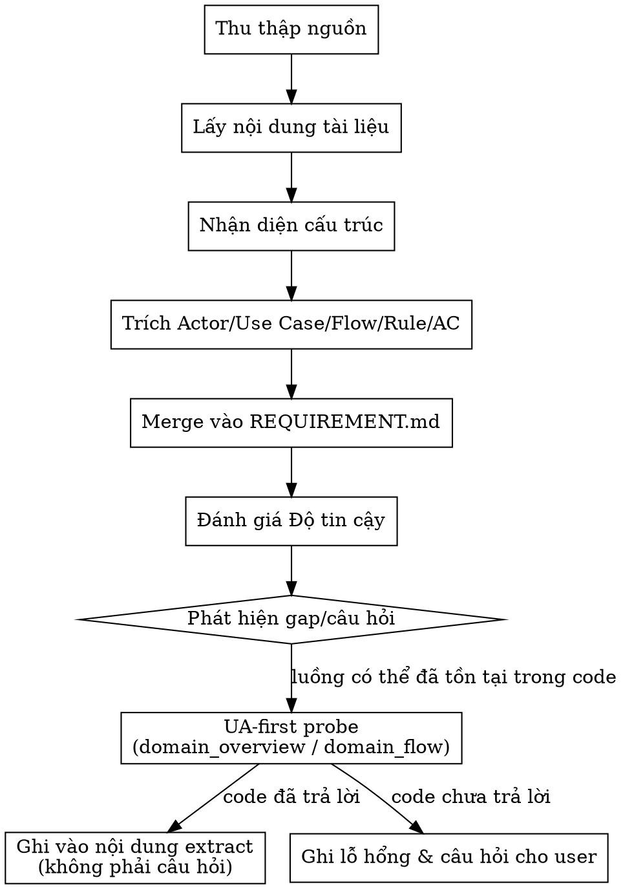

# Quy trình chi tiết

## Mục lục

- Flow tổng quan
- Bước 1 — Xác định & thu thập nguồn
- Bước 2 — Lấy nội dung tài liệu
- Bước 3 — Nhận diện cấu trúc nội dung
- Bước 4 — Trích Actor & Use Case
- Bước 5 — Trích luồng chính và luồng lỗi
- Bước 5b — Thống kê Integration & Field Mapping
- Bước 5c — Vẽ ASCII Flow / State Diagram
- Bước 6 — Trích quy tắc nghiệp vụ (Business Rules)
- Bước 7 — Trích Acceptance Criteria & ràng buộc phi chức năng
- Bước 8 — Merge vào REQUIREMENT.md
- Bước 9 — Đánh giá Độ tin cậy tài liệu
- Bước 10 — Ghi lỗ hổng & câu hỏi cần làm rõ

## Flow tổng quan



### Bước 1 — Xác định & thu thập nguồn

1. Nhận URL từ:
   - Ticket (link trong description / comment).
   - User cung cấp trong chat.
2. Nếu user chỉ nêu từ khoá (chưa có URL cụ thể):
   - Dùng MCP server cho wiki/Confluence (nếu có) để search theo từ khoá.
   - Đề xuất vài kết quả, nhờ user chọn 1–2 trang chính.
3. Xác định:
   - Trang “gốc” (master).
   - Trang con / tài liệu phụ trợ cần đọc thêm (nếu có).

---

### Bước 2 — Lấy nội dung tài liệu

1. Dùng MCP của hệ thống tài liệu (Confluence/wiki/…) để:
   - Lấy nội dung chính của trang ở dạng markdown / plain text.
   - Liệt kê child pages / linked pages trực tiếp liên quan.
   - Liệt kê attachment (file đính kèm):
     - Chỉ tải xuống những file cần cho hiểu yêu cầu (ví dụ: OpenAPI spec, diagram kiến trúc quan trọng).
2. Chuẩn hoá về một dạng text dễ xử lý (markdown/plain), bỏ layout không cần thiết (style, macro…).

---

### Bước 3 — Nhận diện cấu trúc nội dung

Từ nội dung thu được:

1. Nhận diện các section thường gặp (tên có thể khác nhau, cần suy luận linh hoạt):

   - Purpose / Overview / Introduction.
   - Actors / Personas / Stakeholders.
   - Use cases / User stories / Scenarios.
   - Business Rules / Rules / Constraints.
   - Main Flow / Basic Flow / Normal Scenario.
   - Alternate Flow / Error Flow / Exceptional Flow.
   - API / Interface / Contract (chi tiết integration xử lý ở Bước 5b).
   - Non-functional / Performance / Security / Compliance.
   - Risks / Limitations / Assumptions.

2. Đánh dấu (mental map) phần nào là “yêu cầu cốt lõi”, phần nào là “bối cảnh rộng”.

---

### Bước 4 — Trích Actor & Use Case

1. Từ các section liên quan:

   - Liệt kê **actor**:
     - Loại người dùng / hệ thống / job nền tương tác với hệ thống.
   - Liệt kê **use case**:
     - Tên use case.
     - Mục tiêu (goal) của actor khi thực hiện use case đó.

2. Chuẩn hoá vào REQUIREMENT:

   ```md
   #### Actor & Use Case

   - Actor A: mô tả ngắn.
     - Use case 1: mục tiêu...
     - Use case 2: mục tiêu...

   - Actor B: ...
   ```

---

### Bước 5 — Trích luồng chính và luồng lỗi

1. Tìm mô tả step-by-step:

   - Luồng chính (happy path).
   - Luồng lỗi / ngoại lệ / nhánh thay thế.

2. Nếu tài liệu có đánh số bước rõ ràng:
   - Giữ nguyên thứ tự logic, rút gọn câu chữ.
3. Nếu mô tả rải rác:
   - Gom lại thành các bước theo logic xảy ra (trước → trong → sau).
   - Không thêm bước mới nếu không có cơ sở trong tài liệu.

4. Ghi vào REQUIREMENT theo cấu trúc:

   ```md
   #### Luồng chính

   1. ...
   2. ...
   3. ...

   #### Luồng lỗi / ngoại lệ

   - Trường hợp X: ...
   - Trường hợp Y: ...
   ```

---

### Bước 5b — Thống kê Integration & Field Mapping

1. Quét tài liệu tìm dấu hiệu integration third-party mới:

   - Section API spec / Interface / Contract / Integration (đã nhận diện ở Bước 3).
   - Bảng endpoint, sample request/response payload, attachment OpenAPI/WSDL (đã thu ở Bước 2).
   - Câu mô tả dạng "hệ thống gọi X" / "nhận callback từ Y".

2. Với mỗi integration phát hiện được, ghi block theo format template `REQUIREMENT.tpl.md`
   (section "Integrations & Field Mapping"): tên, hướng (outbound/inbound), protocol & auth,
   endpoint/operation, tài liệu nguồn.

3. Lập bảng field mapping cho từng integration:

   - **Field third-party**: lấy nguyên văn từ tài liệu/API spec (vd `mobileNo`).
   - **Field canonical**: xác định theo **UA-first** (§Quy tắc cốt lõi):
     `{{ tools.domain_overview }}` → domain/DTO liên quan, sau đó Codebase Memory extract
     field trong DTO/domain model hiện có (vd `phoneNumber` trong `CustomerDTO`).
   - **Transform / Serialize**: chỉ ghi **ý định** (rename, format date, split/merge, dịch enum).
     KHÔNG ghi cú pháp ngôn ngữ cụ thể (`@JsonProperty`, pydantic alias…) — executor Pha 3
     resolve cú pháp từ conventions/author-dna.
   - **Nguồn**: trích dẫn section tài liệu + node UA đã probe.

4. Field không xác định được canonical (domain model chưa có field tương ứng, UA không trả lời):

   - Ghi vào "Field chưa map được" kèm lý do.
   - Mirror thành câu hỏi trong "Lỗ hổng & câu hỏi mở" (Bước 10).

5. Không có integration mới → ghi rõ "Không phát hiện integration mới" (không bỏ trống section).

---

### Bước 5c — Vẽ ASCII Flow / State Diagram

1. Nếu tài liệu có flow, state, integration, callback, job, hoặc data path, thêm section:

   ~~~md
   #### ASCII Flow / State Diagram

   ```text
   actor / system A
     -> bước xử lý hoặc state
     -> boundary nội bộ / bên ngoài
     -> kết quả hoặc nhánh tiếp theo
   ```
   ~~~

2. Diagram phải ưu tiên overview trước:
   - Actor / system chính.
   - Boundary nội bộ ↔ bên ngoài.
   - Happy path.
   - Nhánh lỗi hoặc async handoff quan trọng.

3. Nếu có nhiều flow:
   - Vẽ một overview diagram.
   - Chỉ vẽ diagram nhỏ cho nhánh phức tạp nếu prose dễ gây mơ hồ.

4. Diagram phải đánh dấu `unknown`, `assumption`, hoặc `needs BA/PO confirmation` khi evidence chưa đủ.

5. Không dùng diagram để thay thế Luồng chính, Luồng lỗi, Acceptance Criteria, hoặc Field Mapping. Diagram chỉ làm rõ trình tự và boundary.

---

### Bước 6 — Trích quy tắc nghiệp vụ (Business Rules)

1. Tìm các câu thể hiện ràng buộc / rule:

   - Điều kiện hợp lệ / không hợp lệ.
   - Giới hạn, ngưỡng, threshold.
   - Quan hệ giữa trạng thái / field.
   - Quy tắc tính toán, điều kiện phê duyệt, v.v.

2. Viết lại thành **bullet rõ ràng, độc lập**:

   - Mỗi bullet = 1 rule.
   - Cố gắng tách các rule “AND/OR” thành nhiều dòng nếu dễ hiểu hơn.

3. Ghi vào REQUIREMENT:

   ```md
   #### Quy tắc nghiệp vụ

   - Rule 1: ...
   - Rule 2: ...
   ```

---

### Bước 7 — Trích Acceptance Criteria & ràng buộc phi chức năng

1. **Acceptance Criteria (AC)**:

   - Nếu tài liệu có AC/test case:
     - Chuẩn hoá thành checklist:
       - Điều kiện đầu vào.
       - Hành vi hệ thống.
       - Kết quả quan sát được.
   - Nếu không có AC rõ:
     - Chỉ trích những gì có thể chuyển thành AC một cách an toàn.
     - Không tự bịa thêm behavior vượt ngoài những gì tài liệu nêu.

2. **Non-functional constraints**:

   - Tìm thông tin về:
     - Hiệu năng (thời gian phản hồi, throughput…).
     - Bảo mật, quyền truy cập.
     - Độ sẵn sàng, recovery, logging, audit.
   - Ghi lại gọn gàng thành bullet.

---

### Bước 8 — Merge vào REQUIREMENT.md

1. Nếu `{{ platform.framework_root }}/knowledge/active/REQUIREMENT.md` **chưa có**:

   - Tạo skeleton mới với các section chuẩn (metadata, context, As-is/To-be, Scope…).
   - Đổ phần trích từ tài liệu vào các section phù hợp (đặc biệt là “Yêu cầu nghiệp vụ trích từ tài liệu”).

2. Nếu `{{ platform.framework_root }}/knowledge/active/REQUIREMENT.md` **đã có** (ví dụ sau `requirement-analyst`):

   - **Không xoá** phần đã có từ ticket.
   - Merge theo nguyên tắc:
     - Business context: có thể bổ sung thêm chi tiết từ tài liệu.
     - Actor/use case/flow/rule/AC: kết hợp; nếu có xung đột → đưa vào phần “Vấn đề yêu cầu”.
   - Ghi chú rõ nguồn:
     - Cái gì đến từ ticket.
     - Cái gì đến từ tài liệu.

---

### Bước 9 — Đánh giá Độ tin cậy tài liệu

Dựa trên:

- **Mức độ cập nhật**:
  - Tài liệu có ghi outdated / deprecated không?
  - Có comment/cảnh báo nào nói tài liệu cũ không?
- **Độ đầy đủ**:
  - Actor, use case, flow, rule, AC… có tương đối đầy đủ không?
- **Mâu thuẫn nội bộ / với nguồn khác**:
  - Tài liệu này có mâu thuẫn với ticket hoặc tài liệu khác không?

Gán mức:

- **CAO**:
  - Cấu trúc tốt, ít mơ hồ, không có dấu hiệu outdated.
- **TRUNG BÌNH**:
  - Một số thiếu sót nhưng có thể dùng được; cần kết hợp với nguồn khác.
- **THẤP**:
  - Mâu thuẫn nhiều, outdated rõ ràng, bỏ sót phần quan trọng của requirement.

Ghi vào REQUIREMENT:

```md
#### Độ tin cậy tài liệu

- Mức: CAO / TRUNG BÌNH / THẤP
- Lý do: ...
```

Nếu THẤP:

- Ghi thêm cảnh báo trong REQUIREMENT.
- Khuyến nghị dừng pipeline ở bước kiến trúc/implementation cho tới khi tài liệu được cập nhật.

---

### Bước 10 — Ghi lỗ hổng & câu hỏi cần làm rõ

1. Liệt kê rõ:

   - Phần nào tài liệu **không đề cập** (ví dụ: case edge, luồng lỗi, migration).
   - Field chưa map được từ Bước 5b (integration có field không tìm thấy canonical tương ứng).
   - Phần nào **mơ hồ** (ví dụ: “nhanh hơn”, “tốt hơn” không có định lượng).
   - Bất kỳ mâu thuẫn nào giữa các phần trong tài liệu hoặc với ticket.

2. **Trước khi ghi bất kỳ gap/câu hỏi nào** (UA-first probe — đối chiếu code):
   - Nếu gap có dạng "tài liệu không nói rõ luồng X hoạt động thế nào" hoặc "không chắc entry point ở đâu":
     - Chạy probe nhẹ: `{{ tools.domain_overview }}` → domain tương ứng đã tồn tại trong hệ thống chưa?
     - Nếu có: `{{ tools.domain_flow }}` → entry point + step hiện tại.
   - **Code đã trả lời** (luồng tồn tại, entry point rõ) → ghi thẳng vào nội dung extract tương ứng (Luồng chính/Luồng lỗi/Actor & Use Case ở các Bước 4–5), **KHÔNG** đưa vào "Lỗ hổng & câu hỏi mở".
   - **Code chưa trả lời** (không tìm thấy domain/flow tương ứng, hoặc câu hỏi thuộc về ý định nghiệp vụ chứ không phải hiện trạng code) → giữ lại như gap/câu hỏi thật cho user.

3. Ghi vào REQUIREMENT:

   ```md
   #### Lỗ hổng & câu hỏi mở

   - Lỗ hổng 1: ...
   - Câu hỏi 1: ...
   ```
