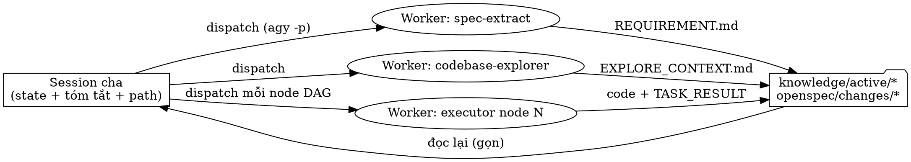

# Thiết kế: Chất lượng Task-Run — Integration Inventory + Thin Orchestrator

> Ngày: 2026-07-03
> Trạng thái: draft-for-review
> Cập nhật 2026-07-04: đường vận hành Pha 3 fresh-session (LLM gọi dispatch_worker thủ công, §B)
> được code-hóa bởi docs/superpowers/specs/2026-07-04-phase3-driver-thin-orchestrator-design.md —
> mô tả LLM-driven trong §B là lịch sử; cơ chế dispatch_worker/worker_command giữ nguyên hiệu lực.
> Phạm vi: Maika upstream (`.maika/`, `cli/`). Xuất phát từ một lần chạy task thực tế ở downstream (ticket Jira + tài liệu Confluence, runtime Antigravity).

## Vấn đề

Một lần chạy task thực tế ở downstream bộc lộ hai lỗi ở tầng framework.

1. **Thiếu inventory tích hợp.** `spec-extract` có nhận diện section "API / Interface / Contract" khi phân tích cấu trúc tài liệu (Bước 3) nhưng không có bước nào trích xuất nó. `REQUIREMENT.md` vì vậy thiếu: danh sách integration third-party mới mà hệ thống cần kết nối, bảng chuẩn hóa field third-party → field canonical (vd `mobileNo` → `phoneNumber`), và ý định transform/serialize. Code sinh ra sau đó thiếu mapping DTO đúng (vd `@JsonProperty` trong codebase Java). Lỗ hổng tương tự tồn tại ở `requirement-analyst` (đường ticket).

2. **Tràn context phá vỡ tuân thủ quy trình.** Sau pha explore dài (Confluence + hỏi–đáp), context của session bị tràn/compact; agent mất toàn bộ workflow instructions, `conventions.yaml` và `author-dna.yaml` đã đọc lúc bootstrap, rồi code hoàn toàn cảm tính — chỉ tuân thủ khi user nhắc tay. User rollback code, giữ lại file context, mở session mới implement từ chính spec đó → kết quả tốt. Lặp lại pattern này (session mới cho mỗi pha và mỗi phần) cho thấy agent hiểu đúng hơn và tuân thủ quy trình hơn một cách nhất quán.

   Các lớp phòng thủ hiện có không giữ được:
   - `[SESSION-BOUNDARY]` trong `workflows/task.md` chỉ cảnh báo, không chặn.
   - `write-gate` chỉ validate **hình thức** artifact (checkpoint, section của handoff, allowed files), không validate độ tươi của context — agent đã loãng vẫn thỏa gate một cách máy móc trong khi code cảm tính.
   - `profiles/execution-mode.yaml` đã đặt tên đúng tier cho Antigravity (`fresh-session → new session per task`) nhưng hoàn toàn thủ công.

   Câu hỏi cốt lõi của user: **làm sao có được chất lượng của session mới mà không phải mở session thủ công.**

## Mục tiêu

- `REQUIREMENT.md` có section *Integrations & Field Mapping* có cấu trúc, và bảng mapping sống xuyên suốt pipeline: Pha 2 bắt buộc sinh task mapper/adapter; Pha 3 nhúng bảng mapping vào handoff để code sinh ra hiện thực đúng mapping.
- Tự động hóa tier `fresh-session`: các bước đọc nặng ở Pha 1 và từng node code ở Pha 3 chạy trong worker context dùng-một-lần; session cha (parent) chỉ giữ state, tóm tắt và đường dẫn file, sống qua cả task mà không tràn.
- Lưới an toàn cơ học: code write inline trong session đã chạy Pha 1/2 bị chặn kèm message hướng dẫn hành động cụ thể.
- Giữ ngôn ngữ trung lập: Pha 1 chỉ ghi ý định transform; cú pháp serialize cụ thể do executor resolve từ slice conventions/author-dna.
- Không tệ hơn hiện trạng trên runtime không expose session identity (degrade về hành vi hiện tại).

## Ngoài phạm vi (Non-Goals)

- Không làm pipeline headless hoàn toàn (`maika run-task <ticket>`). Hỏi–đáp Pha 1 vẫn tương tác trong session cha.
- Không tạo skill riêng cho integrations (net-negative complexity; thiết kế này mở rộng skill có sẵn).
- Không thay đổi cơ chế handoff-freshness đã giao ở PR #15/#16.
- Không cố ngăn runtime compact session cha; thiết kế làm cho việc compact trở nên vô hại bằng cách giữ parent mỏng.

## Phần A — Integrations & Field Mapping

### A1. Tầng template — `knowledge/templates/REQUIREMENT.tpl.md`

Section mới đặt sau "Technical Design Contract":

```markdown
## Integrations & Field Mapping

<!-- Một block cho mỗi integration mới (third-party API hệ thống cần gọi/nhận). -->
<!-- Nếu task không có integration mới: ghi "Không phát hiện integration mới". -->

### Integration: <tên>
- Hướng: outbound (hệ thống gọi third-party) / inbound (third-party gọi hệ thống)
- Protocol & Auth: REST/gRPC/SOAP/… + cơ chế auth
- Endpoint/Operation liên quan: …
- Tài liệu nguồn: <link doc / API spec>

| Field third-party | Field canonical (hệ thống) | Transform / Serialize (ý định) | Nguồn |
|---|---|---|---|
| mobileNo | phoneNumber | rename khi (de)serialize | doc §4.2 + UA: CustomerDTO |

- Field chưa map được: <field> — lý do (tự động trở thành Open Question)
```

Cột "Transform / Serialize" ghi **ý định** (rename, format date, split/merge, dịch enum) — không bao giờ ghi cú pháp ngôn ngữ cụ thể.

### A2. Trích xuất ở Pha 1

- `skills/spec-extract/SKILL.md`: thêm **Bước 5b** mới (sau Bước 5, trước Business Rules): quét nguồn tìm contract API third-party (section API spec, bảng endpoint, sample payload, attachment OpenAPI đã thu ở Bước 2). Với mỗi integration: ghi hướng, protocol, auth, endpoint, và danh sách field. Xác định field canonical theo **UA-first** (node domain model/DTO hiện có); field không resolve được → "Field chưa map được" và mirror vào "Lỗ hổng & câu hỏi mở" (Bước 10). Cập nhật skeleton output ở §3 với section mới.
- `skills/requirement-analyst/SKILL.md`: mở rộng **Bước 8 (Technical Design Contract)** với cùng logic trích xuất + bảng cho đường ticket, dùng chung format template.

### A3. Pha 2 — sinh spec

- `workflows/task.md` §2: thêm instruction — mỗi integration trong REQUIREMENT phải có ít nhất một task mapper/adapter tương ứng trong `tasks.md` của OpenSpec; DTO + mapping thuộc **contract node** trong `CONTRACT_DAG.md` (theo phân loại node của SP1d).
- `skills/spec-validator/SKILL.md`: check mới `check_integration_coverage(spec_path, requirement_path)` — integration có trong REQUIREMENT nhưng không có task tương ứng → **cảnh báo** liệt kê integration chưa cover và hỏi user có tiếp tục không (cùng mức nghiêm trọng với `check_ac_coverage`).

### A4. Pha 3 — handoff

- `workflows/task.md` §3.5a: nguồn build `KNOWLEDGE_PACK.md` thêm section Integrations của REQUIREMENT.
- Handoff của node mapper/adapter nhúng **nguyên bảng mapping** của integration đó vào `## Evidence` / `## Constraints`. Executor resolve cú pháp serialize cụ thể từ `dna_slice` / convention slice trong cùng handoff.

### A5. Xử lý lỗi

- Không tìm thấy integration → section ghi "Không phát hiện integration mới"; validator bỏ qua check coverage.
- Tài liệu API mơ hồ/thiếu → phản ánh vào Độ tin cậy + Open Questions. Không bao giờ bịa field hay endpoint.

## Phần B — Thin Orchestrator + Tự động dispatch Fresh-Session

### B1. Nguyên tắc — tầng rules

Rule mới trong `rules/rules-flow.md`:

- **Orchestrator mỏng**: context của agent cha (orchestrator) chỉ giữ phase state, tóm tắt ngắn, và đường dẫn file. Nội dung thô khối lượng lớn — trang tài liệu, quét code diện rộng, log dài — phải được tiêu thụ trong worker context và persist kết quả ra file knowledge; parent chỉ đọc lại file kết quả.
- **Reflex routing**: yêu cầu freeform "viết spec/code" sau khi Pha 1/2 đã chạy phải được route về `/task spec` / `/task apply` (nơi dispatch worker); không bao giờ code inline từ trí nhớ hội thoại.

### B2. Profile thực thi — `profiles/execution-mode.yaml`

Thêm template lệnh worker theo platform:

```yaml
execution_mode: fresh-session        # subagent | fresh-session | inline-reload
worker_command: 'agy -p "{prompt}"'  # dùng cho fresh-session; tier subagent bỏ qua
max_retries: 2
worker_timeout_seconds: 900
```

Giá trị scaffold mặc định theo platform (`cli/platforms/*`): Antigravity → `fresh-session` + `agy -p`; Codex → `fresh-session` + `codex exec`; Claude Code → `subagent` (Agent tool; không dùng `worker_command`). `inline-reload` vẫn là fallback LCD, giữ nguyên hành vi hiện tại.

### B3. Helper dispatch — `tools/microloop-orchestrator/orchestrator.py`

Hàm mới `dispatch_worker(prompt, *, timeout, retries)`:

- Render `worker_command` với prompt, chạy subprocess, bắt exit code và output.
- Tôn trọng `max_retries` và `worker_timeout_seconds`.
- Append các event ACTIVITY_LOG có sẵn (`subagent_spawned` / `subagent_started` / `subagent_done` / `subagent_blocked`) — contract với dashboard không đổi.

### B4. Dispatch Pha 1 — `workflows/task.md` §1

Khi `execution_mode != inline-reload`, các skill nặng chạy trong worker thay vì inline:

- `spec-extract`, `codebase-explorer`, `db-explorer` được dispatch với prompt dạng: *"Đọc `{{ platform.framework_root }}/skills/<skill>/SKILL.md`, thực thi với input `<URL/ticket>`, ghi output vào file knowledge mà skill chỉ định."*
- Parent chỉ đọc lại `REQUIREMENT.md` / `EXPLORE_CONTEXT.md` (+ ghi chú độ tin cậy trong AGENT_TRANSPARENCY) — artifact gọn, có giới hạn.
- Hỏi–đáp với user vẫn ở parent, dựa trên REQUIREMENT đã ghi.

### B5. Dispatch Pha 3 — `workflows/task.md` §3.5c/d

Dispatch executor cho tier `fresh-session` trở thành lời gọi `dispatch_worker` với prompt: *"Đọc `{{ platform.framework_root }}/procedures/executor.md` và thực thi `TASK_HANDOFF.<node-id>.md`."* Mỗi node nhận một worker context mới tinh; vòng đời `TASK_QUEUE` / `TASK_RESULT` / ACTIVITY_LOG không đổi. Lời nhắc thủ công "mở session mới cho mỗi task" được thay bằng đường tự động.

### B6. Lưới an toàn session gate — `hooks/write-gate/write_gate.py`

- **Nhận diện session** theo thứ tự: (1) session/conversation id từ hook payload; (2) fallback POSIX — định danh process tổ tiên của agent (pid + start time đọc từ `/proc`), ổn định qua compact nhưng đổi khi restart session; (3) không có → degrade.
- **State**: sidecar `knowledge/active/.session_state.json`, do chính hook ghi. Hook vốn đã đọc `AGENT_TRANSPARENCY.md` mỗi lần fire; khi lần đầu quan sát thấy `phase_state` ∈ {`phase-1-done`, `phase-2-done`} thì ghi `{phase, session_identity, timestamp}`.
- **Luật chặn**: với code write (phân loại có sẵn: không phải framework artifact, không phải documentation), nếu session identity hiện tại trùng identity đã ghi cho `phase-1-done` hoặc `phase-2-done` → **CHẶN**:

  > `[SESSION-GATE] Pha 1/2 đã chạy trong session này — context có nguy cơ đã tràn/compact. Dispatch node qua worker (procedures/executor.md + TASK_HANDOFF) hoặc mở session mới rồi chạy /task apply <ticket>. User có thể override tường minh: ghi {{ platform.framework_root }}/knowledge/active/SESSION_OVERRIDE.md (sẽ được log vào Violation Log).`

- **Override**: `SESSION_OVERRIDE.md` (template nhỏ) chứa ticket-id + lý do + dòng xác nhận của user. Gate cho qua khi file tồn tại và ticket khớp task đang active, đồng thời ghi một dòng violation vào AGENT_TRANSPARENCY. `knowledge-curator` archive file này cùng task.
- **Degrade**: không có session identity → cho qua + cảnh báo stderr (hành vi hiện trạng, ghi nhận là residual risk).
- **Vòng đời**: `.session_state.json` nằm trong `knowledge/active/` nên được `knowledge-curator.reset_active_context()` dọn khi archive task — state cũ của task trước không bao giờ chặn nhầm task sau.

### B7. Messaging — `workflows/task.md` + escalation theo TOKEN_LOG

- Viết lại ba block `[SESSION-BOUNDARY]`: đường chính là dispatch worker tự động; mở session mới thủ công là fallback. Nhánh warn-and-continue giờ nêu rõ session gate ("code write inline sẽ bị chặn").
- Nếu estimate token của pha trong `TOKEN_LOG.md` vượt ngưỡng 50k có sẵn → message boundary chuyển từ khuyến nghị sang **bắt buộc**, nêu rõ rủi ro tràn/compact.

## Luồng dữ liệu



## Kiểm thử

- **Unit test write-gate** (`hooks/write-gate/tests/test_write_gate.py`):
  1. code write, cùng session identity với `phase-1-done`/`phase-2-done` → chặn;
  2. `SESSION_OVERRIDE.md` hợp lệ, khớp ticket active → cho qua + đã log violation;
  3. session identity khác → cho qua (các gate khác vẫn áp dụng);
  4. không có identity → cho qua + cảnh báo;
  5. `.session_state.json` được ghi ở lần đầu quan sát mỗi phase marker.
- **Test helper dispatch**: render lệnh từ `worker_command`, retry khi exit khác 0, timeout, event ACTIVITY_LOG được ghi (mock subprocess).
- **Test spec-validator**: integration trong REQUIREMENT không có task khớp trong `tasks.md` → cảnh báo coverage liệt kê đúng; không có integration → bỏ qua check.
- **E2E thủ công trên Antigravity** (repo downstream, một ticket thật): (a) REQUIREMENT có section Integrations với bảng mapping; (b) các bước đọc nặng Pha 1 chạy qua worker `agy -p` và parent giữ gọn; (c) node Pha 3 được dispatch từng worker; (d) code write inline ở parent sau Pha 2 bị chặn với đúng message.

## Điểm cần xác minh khi implement

Giải quyết trong lúc implement; mỗi điểm có fallback xác định:

1. `agy -p` chạy non-interactive với quyền ghi file và flag cần thiết (user dùng pattern này hằng ngày; xác nhận flag chính xác). Fallback: ghi rõ config agy bắt buộc vào README scaffold.
2. Hook payload của Antigravity có mang session/conversation id không. Fallback: định danh process POSIX.
3. Dạng gọi headless chính xác của Codex (`codex exec` + flag auto-approve). Fallback: Codex dùng `inline-reload` cho tới khi xác minh xong.
4. Windows: không có `/proc` → session gate degrade về cảnh báo (nhất quán với residual risk Windows đã ghi nhận).

## Triển khai (Rollout)

1. Land upstream vào Maika; chạy pytest matrix.
2. Cập nhật repo downstream đã gặp lỗi qua `maika update`; chạy E2E thủ công ở trên với một ticket thật.
3. Nếu Antigravity thực sự không expose session identity, gate ship ở chế độ degrade trên platform đó và phần tự động dispatch (B3–B5) gánh vai trò fix chính — hai phần độc lập, mỗi phần tự nó đã có giá trị.
