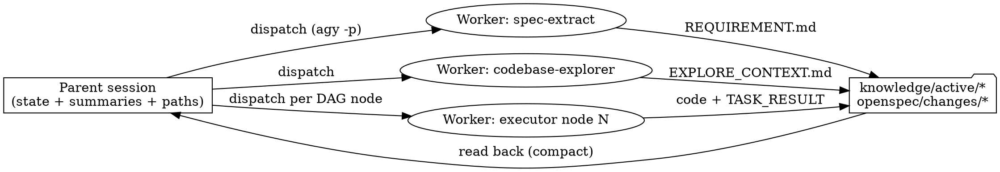

# Task-Run Quality: Integration Inventory + Thin Orchestrator Design

> Date: 2026-07-03
> Status: draft-for-review
> Scope: Maika upstream (`.maika/`, `cli/`). Driven by one observed downstream task run (Jira ticket + Confluence docs, Antigravity runtime).

## Problem

A real downstream task run exposed two framework-level failures.

1. **Missing integration inventory.** `spec-extract` recognizes "API / Interface / Contract" sections during structure detection (Bước 3) but no step extracts them. `REQUIREMENT.md` ends up without: the list of new third-party integrations the system must call, the third-party → canonical field mapping (e.g. `mobileNo` → `phoneNumber`), and the transform/serialization intent. Generated code then lacks proper DTO mapping (e.g. `@JsonProperty` in a Java codebase). The same gap exists in `requirement-analyst` (ticket path).

2. **Context overflow destroys process compliance.** After a long Pha-1 explore (Confluence + Q&A), the session context overflowed/compacted. The agent lost the workflow instructions, `conventions.yaml`, and `author-dna.yaml` it had read at bootstrap, and coded entirely by feel — complying only when the user manually reminded it. The user rolled back the code, kept the context files, re-implemented from the same spec in a fresh session, and got good results. Repeating this pattern (fresh session per phase and per part) consistently produced better understanding and compliance.

   Existing defenses did not hold:
   - `[SESSION-BOUNDARY]` in `workflows/task.md` is warn-only.
   - `write-gate` validates artifact **form** (checkpoint, handoff sections, allowed files), not context freshness — a diluted agent can satisfy it mechanically while coding by feel.
   - `profiles/execution-mode.yaml` already names the correct tier for Antigravity (`fresh-session → new session per task`) but it is entirely manual.

   The user's actual ask: **get fresh-session quality without manually opening sessions.**

## Goals

- `REQUIREMENT.md` carries a structured *Integrations & Field Mapping* section, and the mapping survives end-to-end: Pha 2 must emit mapper/adapter tasks; Pha 3 handoffs embed the mapping table so generated code implements it.
- Automate the `fresh-session` execution tier: heavy Pha-1 reads and every Pha-3 code node run in disposable worker contexts; the parent chat session holds only state, summaries, and file paths, and survives the whole task without overflowing.
- Mechanical safety net: inline code writes in a session that already ran Pha 1/2 are blocked with an actionable remediation message.
- Stay language-neutral: transform intent in Pha 1; concrete serialization syntax resolved by the executor from conventions/author-dna slices.
- No regression on runtimes where session identity is unavailable (degrade to today's behavior).

## Non-Goals

- No fully headless pipeline (`maika run-task <ticket>`). Pha-1 Q&A stays interactive in the parent session.
- No new standalone skill for integrations (net-negative complexity; this extends existing skills).
- No changes to handoff-freshness mechanics delivered in PR #15/#16.
- Not preventing runtime compaction of the parent session; the design makes compaction irrelevant by keeping the parent thin.

## Part A — Integrations & Field Mapping

### A1. Template layer — `knowledge/templates/REQUIREMENT.tpl.md`

New section placed after "Technical Design Contract":

```markdown
## Integrations & Field Mapping

<!-- Một block cho mỗi integration mới (third-party API hệ thống cần gọi/nhận). -->
<!-- Nếu task không có integration mới: ghi "Không phát hiện integration mới". -->

### Integration: <tên>
- Hướng: outbound (hệ thống gọi third-party) / inbound (third-party gọi hệ thống)
- Protocol & Auth: REST/gRPC/SOAP/… + cơ chế auth
- Endpoint/Operation liên quan: …
- Tài liệu nguồn: <link doc / API spec>

| Field third-party | Field canonical (hệ thống) | Transform / Serialize (ý định) | Nguồn |
|---|---|---|---|
| mobileNo | phoneNumber | rename khi (de)serialize | doc §4.2 + UA: CustomerDTO |

- Field chưa map được: <field> — lý do (tự động trở thành Open Question)
```

The "Transform / Serialize" column records **intent** (rename, date format, split/merge, enum translation) — never language syntax.

### A2. Pha 1 extraction

- `skills/spec-extract/SKILL.md`: new **Bước 5b** (after Bước 5, before Business Rules): scan sources for third-party API contracts (API spec sections, endpoint tables, sample payloads, OpenAPI attachments already collected in Bước 2). For each: capture direction, protocol, auth, endpoints, and field list. Resolve canonical fields **UA-first** (existing domain model/DTO nodes); unresolved fields go to "Field chưa map được" and are mirrored into "Lỗ hổng & câu hỏi mở" (Bước 10). Update the output skeleton in §3 with the new section.
- `skills/requirement-analyst/SKILL.md`: extend **Bước 8 (Technical Design Contract)** with the same extraction + table for the ticket path, sharing the template format.

### A3. Pha 2 — spec generation

- `workflows/task.md` §2: add instruction — every integration in REQUIREMENT must map to at least one mapper/adapter task in OpenSpec `tasks.md`; DTO + mapping belong to a **contract node** in `CONTRACT_DAG.md` (per SP1d node taxonomy).
- `skills/spec-validator/SKILL.md`: new check `check_integration_coverage(spec_path, requirement_path)` — integration present in REQUIREMENT with no corresponding task → **warning** listing the uncovered integrations and asking the user whether to continue (same severity model as `check_ac_coverage`).

### A4. Pha 3 — handoff

- `workflows/task.md` §3.5a: `KNOWLEDGE_PACK.md` sources add the Integrations section of REQUIREMENT.
- Handoffs for mapper/adapter nodes embed the **full mapping table** for that integration in `## Evidence` / `## Constraints`. The executor resolves concrete serialization syntax from the `dna_slice` / convention slice in the same handoff.

### A5. Error handling

- No integrations found → section reads "Không phát hiện integration mới"; validator skips the coverage check.
- Ambiguous/incomplete API docs → reflected in Độ tin cậy + Open Questions. Never invent fields or endpoints.

## Part B — Thin Orchestrator + Automated Fresh-Session Dispatch

### B1. Principle — rules layer

New rule in `rules/rules-flow.md`:

- **Thin orchestrator**: the parent (orchestrator) context holds only phase state, short summaries, and file paths. Raw bulk content — document pages, wide code sweeps, long logs — must be consumed inside worker contexts that persist results to knowledge files; the parent reads back only the resulting files.
- **Routing reflex**: a freeform request to "write spec/code" after Pha 1/2 has run must be routed to `/task spec` / `/task apply` (which dispatch workers); never code inline from conversational memory.

### B2. Execution profile — `profiles/execution-mode.yaml`

Add a per-platform worker command template:

```yaml
execution_mode: fresh-session        # subagent | fresh-session | inline-reload
worker_command: 'agy -p "{prompt}"'  # used by fresh-session; ignored by subagent tier
max_retries: 2
worker_timeout_seconds: 900
```

Scaffold defaults per platform (`cli/platforms/*`): Antigravity → `fresh-session` + `agy -p`; Codex → `fresh-session` + `codex exec`; Claude Code → `subagent` (Agent tool; `worker_command` unused). `inline-reload` remains the LCD fallback and keeps current behavior.

### B3. Dispatch helper — `tools/microloop-orchestrator/orchestrator.py`

New function `dispatch_worker(prompt, *, timeout, retries)`:

- Renders `worker_command` with the prompt, runs it as a subprocess, captures exit code and output.
- Honors `max_retries` and `worker_timeout_seconds`.
- Appends existing ACTIVITY_LOG events (`subagent_spawned` / `subagent_started` / `subagent_done` / `subagent_blocked`) so the dashboard contract is unchanged.

### B4. Pha 1 dispatch — `workflows/task.md` §1

When `execution_mode != inline-reload`, the heavy skills run in workers instead of inline:

- `spec-extract`, `codebase-explorer`, `db-explorer` are dispatched with prompts of the form: *"Read `{{ platform.framework_root }}/skills/<skill>/SKILL.md`, execute it with input `<URL/ticket>`, write output to the knowledge file the skill specifies."*
- The parent reads back only `REQUIREMENT.md` / `EXPLORE_CONTEXT.md` (+ confidence notes in AGENT_TRANSPARENCY) — bounded, compact artifacts.
- Q&A with the user stays in the parent, grounded on the written REQUIREMENT.

### B5. Pha 3 dispatch — `workflows/task.md` §3.5c/d

Executor dispatch for the `fresh-session` tier becomes a `dispatch_worker` call with prompt: *"Read `{{ platform.framework_root }}/procedures/executor.md` and execute `TASK_HANDOFF.<node-id>.md`."* Every node gets a brand-new worker context; `TASK_QUEUE` / `TASK_RESULT` / ACTIVITY_LOG lifecycle is unchanged. The manual "open a new session per task" instruction is replaced by the automated path.

### B6. Session gate safety net — `hooks/write-gate/write_gate.py`

- **Session identity** resolution order: (1) hook payload session/conversation id; (2) POSIX fallback — ancestor agent process identity (pid + process start time from `/proc`), which is stable across compaction but changes on session restart; (3) unavailable → degrade.
- **State**: sidecar `knowledge/active/.session_state.json`, written by the hook itself. On each invocation the hook already reads `AGENT_TRANSPARENCY.md`; when it first observes `phase_state` ∈ {`phase-1-done`, `phase-2-done`} it records `{phase, session_identity, timestamp}`.
- **Blocking rule**: on a code write (existing classification: not framework artifact, not documentation), if the current session identity equals the identity recorded for `phase-1-done` or `phase-2-done` → **BLOCK**:

  > `[SESSION-GATE] Pha 1/2 đã chạy trong session này — context có nguy cơ đã tràn/compact. Dispatch node qua worker (procedures/executor.md + TASK_HANDOFF) hoặc mở session mới rồi chạy /task apply <ticket>. User có thể override tường minh: ghi {{ framework_root }}/knowledge/active/SESSION_OVERRIDE.md (sẽ được log vào Violation Log).`

- **Override**: `SESSION_OVERRIDE.md` (small template) containing ticket-id + reason + user-approval line. Gate allows when present and ticket matches the active task, and logs a violation entry to AGENT_TRANSPARENCY. `knowledge-curator` archives it with the task.
- **Degrade**: identity unavailable → allow + stderr warning (status quo behavior, explicitly documented residual risk).

### B7. Messaging — `workflows/task.md` + TOKEN_LOG escalation

- The three `[SESSION-BOUNDARY]` blocks are rewritten: the primary path is automated worker dispatch; manually opening a new session is the fallback. The warn-and-continue branch now also names the session gate ("inline code writes will be blocked").
- If the phase token estimate in `TOKEN_LOG.md` exceeds the existing 50k threshold, the boundary message escalates from recommendation to mandatory wording, citing overflow/compaction risk.

## Data Flow



## Testing

- **write-gate unit tests** (`hooks/write-gate/tests/test_write_gate.py`):
  1. code write, same session identity as `phase-1-done`/`phase-2-done` → block;
  2. valid `SESSION_OVERRIDE.md` bound to active ticket → allow + violation logged;
  3. different session identity → allow (other gates still apply);
  4. identity unavailable → allow + warning;
  5. `.session_state.json` recorded on first observation of each phase marker.
- **dispatch helper tests**: command rendering from `worker_command`, retry on non-zero exit, timeout, ACTIVITY_LOG events emitted (subprocess mocked).
- **spec-validator test**: integration in REQUIREMENT without a matching task in `tasks.md` → coverage warning listing it; no integrations → check skipped.
- **Manual E2E on Antigravity** (downstream repo, one real ticket): (a) REQUIREMENT contains the Integrations section with a mapping table; (b) Pha 1 heavy reads run via `agy -p` workers and the parent stays compact; (c) Pha 3 nodes are dispatched per worker; (d) an inline code write in the parent after Pha 2 is blocked with the remediation message.

## Implementation Verification Points

Resolve during implementation; each has a defined fallback:

1. `agy -p` non-interactive file-write permissions and required flags (user runs this pattern daily; confirm exact flags). Fallback: document required agy config in scaffold README.
2. Whether the Antigravity hook payload carries a session/conversation id. Fallback: POSIX process-identity.
3. Exact Codex headless invocation (`codex exec` flags for auto-approval). Fallback: `inline-reload` on Codex until verified.
4. Windows: `/proc` fallback unavailable → session gate degrades to warn (consistent with documented Windows residual risks).

## Rollout

1. Land upstream in Maika; run pytest matrix.
2. Update the failing downstream repo via `maika update`; run the manual E2E above on a real ticket.
3. If session identity proves unavailable on Antigravity, the gate ships in degrade mode there and the dispatch automation (B3–B5) carries the fix — the two parts are independently useful.
