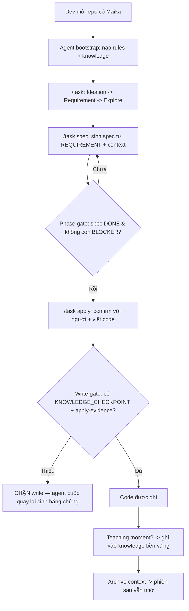
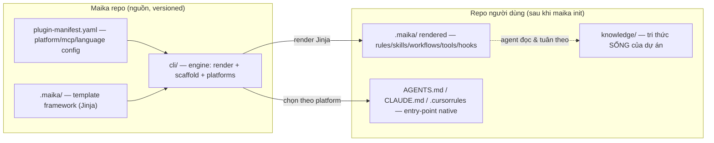
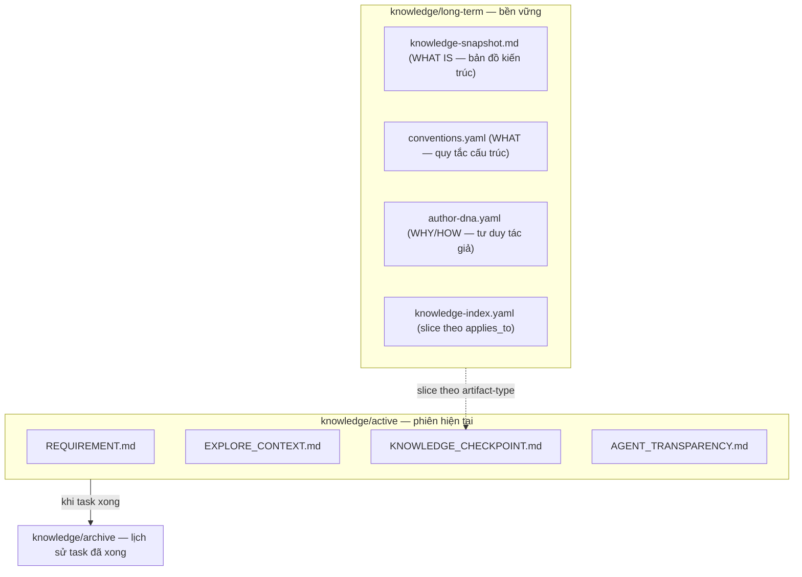
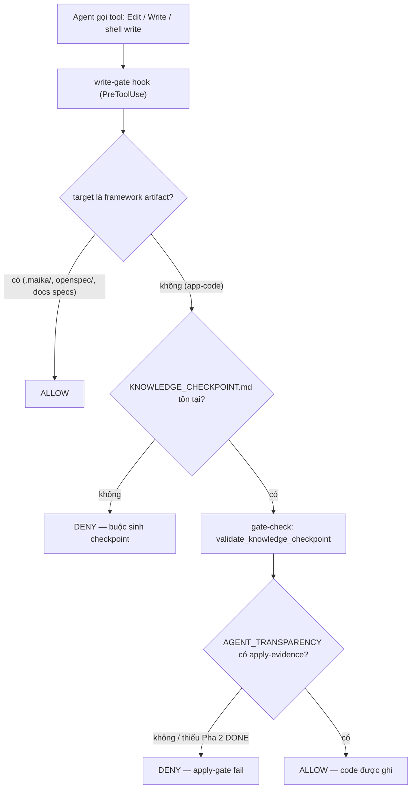
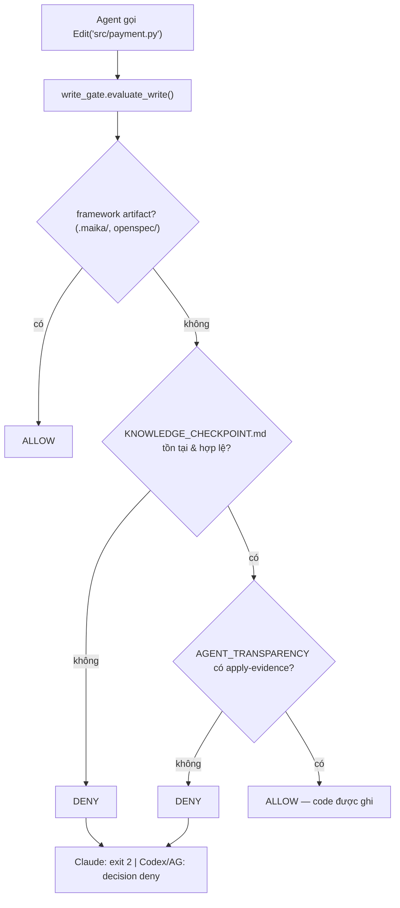

# Maika Framework — Technical Design Document

> **Module:** Maika v3.0 — "the working OS for AI coding agents"
> **Trạng thái**: Draft
> **Ngày tạo**: 2026-06-21
> **Phạm vi tài liệu**: Mô tả cách Maika (framework, không phải một feature đơn lẻ) giải quyết các bài toán cố hữu của AI coding agent.
> **Nguồn**: Đọc trực tiếp từ `.maika/`, `cli/`, `README.md`, `.maika/DEVELOPMENT_RULES.md` tại commit hiện tại.

---

## Mục lục

- [T0 — Bối cảnh: các bài toán của coding agent](#t0--bối-cảnh-các-bài-toán-của-coding-agent)
- [T1 — Chiến lược: vấn đề & mục tiêu](#t1--chiến-lược-vấn-đề--mục-tiêu)
- [T2 — Kiến trúc hệ thống](#t2--kiến-trúc-hệ-thống)
- [T3 — Quyết định thiết kế (ADR)](#t3--quyết-định-thiết-kế-adr)
- [T4 — Vận hành](#t4--vận-hành)
- [Phụ lục A — Khái niệm nền: enforcement cơ học & gate-by-evidence](#phụ-lục-a--khái-niệm-nền-enforcement-cơ-học--gate-by-evidence)
- [Phụ lục B — bản đồ file ↔ cơ chế](#phụ-lục-b--bản-đồ-file--cơ-chế)

---

## T0 — Bối cảnh: các bài toán của coding agent

> Viết bằng ngôn ngữ tự nhiên. Người không lập trình đọc xong vẫn hiểu Maika giải quyết gì.

### Tổng quan

Một AI coding agent (Claude Code, Codex, Cursor, Antigravity…) rất giỏi **sinh code**. Nhưng nó làm việc trong một **cửa sổ chat có trí nhớ ngắn**: hết phiên là quên. Hệ quả là những lỗi lặp đi lặp lại mà người dùng phải sửa thủ công mỗi ngày.

Maika **không phải** một agent mới và không thay thế Claude/Codex/Cursor/Gemini. Nó là một **lớp hệ điều hành làm việc** được scaffold thẳng vào repo: một bộ file hướng dẫn, kỹ năng (skills), quy trình (workflows), luật (rules), công cụ (tools) và một **lớp tri thức bền vững** (knowledge layer) mà bất kỳ agent nào mở repo cũng phải đọc và tuân theo.

> Công thức cốt lõi: **Memory + Workflow + Guardrails + Audit = agent làm việc có kỷ luật.**

### Bảy bài toán Maika nhắm tới

| # | Bài toán của coding agent | Biểu hiện thực tế |
|---|---------------------------|-------------------|
| P1 | **Context rot / mất trí nhớ** | Quên requirement, quyết định kiến trúc đã chốt, lý do "hôm qua dặn đừng làm X". |
| P2 | **Bịa & nhảy thẳng vào code** | Viết code trước khi hiểu codebase; suy luận bằng trí nhớ thay vì bằng bằng chứng (code/DB/docs). |
| P3 | **Prose bị bỏ qua** | Luật viết dạng văn xuôi ("nhớ làm spec trước") bị agent lờ đi khi tiện. |
| P4 | **Non-determinism / drift** | Cùng một yêu cầu, hai phiên cho hai kết quả; bỏ pha tùy hứng. |
| P5 | **Mất bài học (teaching moment)** | User sửa code + giải thích nguyên tắc, nhưng sang phiên sau agent lặp lại đúng lỗi đó. |
| P6 | **Khóa cứng vào một platform** | Hướng dẫn viết riêng cho 1 tool; đổi agent là viết lại từ đầu. |
| P7 | **Không có dấu vết kiểm toán** | Không biết agent đã quyết định gì, ở pha nào, dựa trên đâu. |

### Flow nghiệp vụ (vòng đời một task dưới Maika)



### Thuật ngữ

| Thuật ngữ | Ý nghĩa |
|-----------|---------|
| **Framework root** | Thư mục Maika render vào repo, mặc định `.maika/` (templatize qua `{{ platform.framework_root }}`). |
| **Knowledge layer** | Tập file tri thức bền vững trong repo: `knowledge/active`, `knowledge/long-term`, `knowledge/archive`. |
| **Gate** | Một chốt chặn **cơ học** (script chạy được) cho phép/chặn một hành động, thay cho lời nhắc văn xuôi. |
| **Teaching moment** | Khoảnh khắc user sửa code agent **kèm giải thích nguyên tắc** → phải được capture. |
| **Platform** | Agent runtime mục tiêu: `antigravity`, `claude-code`, `codex`, `generic`. |

---

> **Ranh giới T0 ↔ T1**: Từ đây trở xuống là nội dung kỹ thuật cho Dev/Architect.

---

## T1 — Chiến lược: vấn đề & mục tiêu

### Bối cảnh vấn đề

Gốc rễ của cả 7 bài toán ở T0 là **hai khoảng trống**:

1. **Khoảng trống trí nhớ** — agent không có nơi bền vững, có cấu trúc, để lưu và nạp lại tri thức dự án (requirement, kiến trúc, convention, "tư duy tác giả"). Context window là bộ nhớ bay hơi.
2. **Khoảng trống thực thi (enforcement)** — kể cả khi đã viết luật, luật ở dạng *văn xuôi* thì agent **có thể bỏ qua**. Audit 2026-06-21 ghi nhận: 5/6 capability-flag được khai báo nhưng chỉ 1 cái được gate cơ học; phần còn lại là "lời khuyên" và bị drift.

Maika đặt cược vào một nguyên lý vận hành xuyên suốt:

> **"Gate-by-evidence, not gate-by-instruction"** — chặn bằng bằng chứng kiểm tra được, không chặn bằng lời dặn.

### Mục tiêu đo lường được

| # | Mục tiêu | Cơ chế hiện thực | Cách kiểm chứng |
|---|----------|------------------|------------------|
| G1 | Tri thức sống sót qua phiên | Knowledge layer file-based trong repo (§T2) | Mở phiên mới → `REQUIREMENT.md`/`knowledge-snapshot.md` còn nguyên nội dung. |
| G2 | Không viết code khi chưa có bằng chứng | `write-gate` hook + `gate-check` (§T3-D2) | Cố Edit app-code khi thiếu `KNOWLEDGE_CHECKPOINT.md` → bị chặn (exit 2 / deny). |
| G3 | Không nhảy pha | Phase gate R-Flow-2 + `validate_phase_chain` | `/task apply` khi `AGENT_TRANSPARENCY.md` thiếu `Pha 2 DONE` → ABORT. |
| G4 | Bài học không bị mất | R-DNA-7 + phân tầng author-dna/conventions/snapshot | Teaching moment → entry mới trong `author-dna.yaml`; nếu checkable → rule-projector sinh checkstyle. |
| G5 | Không khóa platform | Renderer Jinja + platform registry (§T2) | Cùng một framework render ra root native cho 4 platform. |
| G6 | Có dấu vết kiểm toán | `AGENT_TRANSPARENCY.md` + token-tracking + dashboard | Mỗi pha để lại marker `Pha N DONE`; dashboard đọc tiến trình. |

### Phạm vi

**Trong phạm vi:** lớp tri thức, workflow theo pha, hệ rule, enforcement cơ học, render đa platform, CLI (`init/update/status/dashboard/doctor`), capture teaching moment.

**Ngoài phạm vi (và vì sao):**

| Item | Lý do loại trừ |
|------|----------------|
| Tự sinh code thay agent | Maika điều phối & ràng buộc agent, không thay agent sinh code. |
| Bundle sẵn MCP memory server | `agentmemory` là **MCP-only boundary** — chỉ tham chiếu qua `{{ tools.dynamic_memory_* }}`, không nhúng (xem T3-D4). |
| Enforcement cho lỗi giả định | DEVELOPMENT_RULES R3: chỉ xây gate cho **lỗi đã quan sát**, có litmus tái hiện. |

---

## T2 — Kiến trúc hệ thống

### Hai nửa: Template tĩnh ↔ Tri thức sống

Maika tách bạch rạch ròi hai loại tài sản — đây là quyết định kiến trúc nền (xem T3-D1):



- **`update` an toàn**: file *framework-owned* được **re-render** đè; còn `knowledge/` và persona của dự án được **giữ lại** (G1 không bị `update` xoá).

### Engine (`cli/`)

| Thành phần | Vai trò |
|------------|---------|
| `cli/maika.py` | Entry CLI. Subcommands: `init`, `update`, `status`, `dashboard`, `doctor mcp`. |
| `cli/platforms/__init__.py` | **Registry** `PLATFORMS = {antigravity, claude-code, codex, generic}`. Mọi platform phải nằm trong dict này mới "tồn tại" (DEVELOPMENT_RULES R2). |
| `cli/platforms/*.py` | Mỗi platform khai `config_entry_point` (vd `CLAUDE.md`), `framework_root`, cơ chế hook. |
| `cli/renderer.py` | Bộ render Jinja: bơm context (`platform.*`, `tools.*`) vào template. |
| `cli/scaffold.py` | Sao chép + render `.maika/` vào target; stage + verify (abort nếu còn marker chưa resolve). |
| `cli/plugin-manifest.yaml` | Khai báo `mcp_capabilities`, `languages`, `plugins` — nguồn cấu hình cho `init`. |

> **Tính templatize**: framework **không hard-code** giá trị dự án. Đường dẫn dùng `{{ platform.framework_root }}`, entry-point dùng `{{ platform.config_entry_point }}`, memory tool dùng `{{ tools.dynamic_memory_* }}`. Nhờ vậy cùng một nguồn chạy trên 4 platform (G5).

### Lớp tri thức (`.maika/knowledge/`) — lời giải cho P1



- **Phân tầng theo mức trừu tượng** (R-DNA-7): cùng một bài học được ghi vào đúng tầng — `author-dna` (bỏ hết tên cụ thể → còn đúng = tư duy), `conventions` (naming/structure), `knowledge-snapshot` (kiến trúc cụ thể).
- **Slice thông minh**: `knowledge-index.yaml` gắn `applies_to` = artifact-type (tag do **project** định nghĩa, **không enum cứng** — DEVELOPMENT_RULES R1) để chỉ nạp tri thức liên quan, tránh nhồi context.

### Lớp luật (`.maika/rules/`) — lời giải cho P3/P4

`RULES.md` là manifest, bootstrap nạp 6 file theo thứ tự cố định; `rules-guard.md` đọc **sau cùng để override**:

| File | Mối quan tâm | Rule tiêu biểu |
|------|--------------|----------------|
| `rules-flow.md` | Luồng bắt buộc, phase gate, bootstrap | `R-Flow-1` (mọi việc qua `/task`), `R-Flow-2` (phase gate), `R-Flow-3` (workflow > agent default) |
| `rules-tool.md` | Quyền MCP & tool | §3 |
| `rules-exec.md` | Data, kiến trúc, cost, observability | §4/5/7/8 |
| `rules-knowledge.md` | Vòng đời knowledge, path, skill schema | §10/12/13/15 |
| `rules-guard.md` | Pre-invoke guard, teaching moment, KI | `R-Guard-2` (knowledge-before-code), `R-DNA-7`, `R-KI-1` |

- **Importance markers**: rule gắn `[CRITICAL]` (không được vi phạm) vs `[REFERENCE]` (đọc lướt) để định hướng "attention" của agent.
- **Thứ tự ưu tiên** (R-Flow-3): `RULES.md` > `workflow/*.md` > entry-point > `SKILL.md` > **agent runtime defaults**. Tức là planning-mode mặc định của Cursor/Antigravity là *secondary*.

### Lớp enforcement cơ học — lời giải cho P2/P3

Đây là trái tim của Maika: biến luật văn xuôi thành **script chạy được**.



- **`.maika/hooks/write-gate/write_gate.py`** (`evaluate_write`): chặn write app-code nếu thiếu `KNOWLEDGE_CHECKPOINT.md` hợp lệ **hoặc** thiếu apply-evidence trong `AGENT_TRANSPARENCY.md`.
- **Cross-platform** bằng một code path, ba kiểu output: Claude (exit 2 + stderr), Codex (`permissionDecision: deny`), Antigravity (`decision: deny`). Đây là cách R5 ("mở rộng chốt chặn đang chạy, không dựng song song") được hiện thực.
- **Bắt cả shell write**: `parse_shell_writes` nhận diện redirect (`>`/`>>`), `tee`, `sed -i`, `cp/mv`, `dd`, `git apply/checkout/restore`, formatter (`prettier --write`, `gofmt -w`, `black`, `ruff --fix`). Write qua shell dựng động/`eval` là residual **được chấp nhận** theo threat model (DEVELOPMENT_RULES R3: không xây cho lỗi chưa quan sát).
- **`.maika/tools/gate-check/gates.py`** — thư viện validator thuần, kiểm tra được & test được: `validate_knowledge_checkpoint`, `validate_apply_gate`, `validate_phase_chain`, `validate_teaching_moment`, `validate_archive_ready`, `validate_mcp_status`, `validate_handoff_slice`, `validate_context_request`, `validate_node_checkpoint`.

### Lớp workflow (`.maika/workflows/`) — lời giải cho P4

`/task` là **cổng vào duy nhất**, ba pha cố định:

```
/task <ý-tưởng>      → Pha 1: Ideation / Requirement / Explore
/task spec <ticket>  → Pha 2: sinh spec (OpenSpec propose)
/task apply <ticket> → Pha 3: apply vào code (có human-in-the-loop)
```

- **Bootstrap bắt buộc mỗi phiên** (R-Boot-1): nạp rules + knowledge trước khi làm gì.
- **Apply-entry** (R-Flow-2) có precondition cơ học: `phase_done(spec)` + spec artifact tồn tại + không còn `[BLOCKER-ARCH]` chưa resolve. "Scope rõ nên bỏ spec" là **không hợp lệ**.
- Ngoài `/task` còn các workflow phụ trợ: `convention-scan`/`approve-conventions`, `dna-scan`/`approve-dna`, `index-source`, họ `opsx-*` (OpenSpec), và `tdd` (chính là workflow đã sinh ra tài liệu này, dùng skill `infra-tdd`).

### Lớp skills & tools

- **`.maika/skills/`** (≈14 skill): `codebase-explorer`, `requirement-analyst`, `architecture-reviewer`, `db-explorer`, `convention-intelligence-builder`, `author-dna-builder`, `knowledge-curator`, `spec-extract/validator`, họ `openspec-*`, `infra-tdd`, `document-writer`… Skill có thể khai `pre_conditions:` và bị guard chặn trước khi chạy (R-Guard-1).
- **`.maika/tools/`**: `gate-check`, `rule-projector` (DNA/convention → IR → checkstyle), `knowledge-index`, `skill-index`, `skill-lint`, `microloop-orchestrator`, `mcp-bridge`, `rule-projector`.

---

## T3 — Quyết định thiết kế (ADR)

### D1 — Tri thức là **file trong repo**, không phải chỉ bộ nhớ MCP

- **Quyết định**: knowledge layer là các file `.md`/`.yaml` versioned trong repo.
- **Vì sao**: file đi cùng repo → portable qua mọi agent/máy, review được qua git, không phụ thuộc một MCP server sống. Đáp ứng G1 + G5.
- **Đánh đổi**: agent phải chủ động đọc/ghi file (tốn vài bước bootstrap) thay vì "memory tự động".

### D2 — **Gate-by-evidence**, không gate-by-instruction

- **Quyết định**: các ràng buộc quan trọng (knowledge-before-code, phase ordering) được hiện thực bằng **hook + validator chạy được**, không chỉ bằng câu chữ trong rule.
- **Vì sao**: bằng chứng quan sát — luật văn xuôi bị bỏ qua; audit thấy capability "khai mà không gate" bị drift. Prose không tạo được sự kiện chặn.
- **Đánh đổi**: phải duy trì hook cho từng runtime; có residual (shell động) chấp nhận theo threat model.

### D3 — **Templatize** thay vì hard-code path/platform

- **Quyết định**: mọi đường dẫn/entry-point/memory-tool đi qua biến Jinja (`{{ platform.framework_root }}`, `{{ platform.config_entry_point }}`, `{{ tools.dynamic_memory_* }}`).
- **Vì sao**: một nguồn → 4 platform native (G5). Framework source chỉ chứa schema/generator/logic, **không** giá trị dự án (DEVELOPMENT_RULES R1).
- **Đánh đổi**: template khó đọc hơn plain file; cần bước render + verify-no-unresolved-marker trong `scaffold`.

### D4 — `agentmemory` là **MCP-only boundary**, không bundle

- **Quyết định**: memory tool tham chiếu qua capability templating `{{ tools.dynamic_memory_* }}`; server không được nhúng, hook tắt mặc định; server-name pin `agent-memory`.
- **Vì sao**: giữ framework không phụ thuộc cứng một server; người dùng tự cắm MCP nếu muốn. `doctor mcp` để chẩn đoán cấu hình/khả dụng runtime.

### D5 — **Net-negative complexity** là mặc định phát triển framework

- **Quyết định**: 7 quy tắc trong `.maika/DEVELOPMENT_RULES.md` chi phối việc sửa chính framework: không khai báo nếu không có consumer (R1); không file ngoài registry (R2); chỉ xây enforcement cho lỗi đã quan sát (R3); verify trigger có thật trước khi thiết kế (R4); mở rộng chốt cũ thay vì dựng song song (R5); đóng dấu doc bị supersede (R6); thêm gì phải biện minh so với xóa (R7).
- **Vì sao**: chính các bài toán agent (đầu cơ, rác, drift) cũng tấn công framework. Rule này giữ framework không tự phình.

---

## T4 — Vận hành

### Vòng đời một phiên

1. **Bootstrap** (R-Boot-1): chạy `procedures/bootstrap.md` → nạp `RULES.md` (6 file) + knowledge active/long-term; phát hiện external KI và WARN cleanup (R-KI-1).
2. **Làm việc theo pha** qua `/task` → `/task spec` → `/task apply`, mỗi pha cập nhật `AGENT_TRANSPARENCY.md`.
3. **Mọi write app-code** đi qua `write-gate` (chặn nếu thiếu bằng chứng).
4. **Teaching moment** xuất hiện → capture ngay trong phiên (R-DNA-7), không defer.
5. **Kết thúc** → self-check + archive context cho phiên sau.

### Lệnh CLI vận hành

| Lệnh | Dùng để |
|------|---------|
| `maika init [--platform --mcp --language --yes]` | Scaffold framework vào dự án (interactive hoặc `--yes`). |
| `maika update [--reconfigure]` | Re-render framework-owned files, **giữ** knowledge. |
| `maika status` | Xem cấu hình Maika hiện tại trong dự án. |
| `maika dashboard [register/list/serve/...]` | Đăng ký dự án & xem tiến trình run (control tower). |
| `maika doctor mcp [--fix --yes]` | Chẩn đoán cấu hình MCP & khả dụng runtime. |

### Self-check & audit (G6)

- **Phase-chain**: `python3 .maika/tools/gate-check/cli.py phase-chain knowledge/active/AGENT_TRANSPARENCY.md` — không phát "Done" tới khi marker `Pha 1/2/3 DONE` liên tục từ 1.
- **Audit trail**: `AGENT_TRANSPARENCY.md` (quyết định + BLOCKER + WARN), `procedures/token-tracking.md` (`TOKEN_LOG`), dashboard đọc tiến trình từ knowledge.

### SLO / litmus

- **Litmus P1.1** (đo bằng chứng hành vi thật) đang **chủ ý hoãn** — theo DEVELOPMENT_RULES R3, enforcement mới phải gắn fixture/litmus tái hiện lỗi; đây là hàng đợi sinh bằng chứng cho các gate tương lai.

### Rủi ro đã biết

| Rủi ro | Giảm thiểu |
|--------|-----------|
| Write qua shell dựng động/`eval` vượt write-gate | Chấp nhận theo threat model; không over-engineer (R3). |
| Agent skip bootstrap | R-Boot-2 trigger phrase: thiếu → coi như chưa bootstrap, làm lại. |
| Doc/spec cũ mâu thuẫn quyết định mới | R6: đóng dấu `Status: SUPERSEDED by <path> (ngày)`. |
| Native skill event không phát trên platform | R4: verify trigger tồn tại trước khi thiết kế lên nó (`native_skill_export = None`). |

---

## Phụ lục A — Khái niệm nền: enforcement cơ học & gate-by-evidence

> Ba khái niệm này là nền của Maika. T2/T3 *dùng* chúng; phụ lục này *dạy* chúng cho người đọc mới.

### A.1 — Nguyên lý "gate-by-evidence, not gate-by-instruction"

Đây là câu trả lời cho một sự thật về LLM: **không thể ra lệnh cho LLM rồi tin chắc nó tuân theo.** So sánh hai cách bắt agent "làm spec trước khi viết code":

- **Instruction (chặn bằng lời dặn):** viết trong `RULES.md` câu *"LUÔN làm spec trước."* Nhưng dòng đó chỉ là token trong context window, cạnh tranh chú ý với mọi thứ khác. LLM phi xác định: lần này nhớ, lần sau tự thuyết phục *"scope rõ rồi, bỏ spec"*. Không có gì **vật lý** ngăn nó. Instruction = lời đề nghị có trọng số, **không** phải rào chắn.
- **Evidence (chặn bằng bằng chứng):** một script kiểm `KNOWLEDGE_CHECKPOINT.md` — *có rule-id thật không? có `node_id` + `blast-radius` không?* Thiếu → chặn tay, agent không ghi được.

Khác biệt cốt lõi (nguyên văn `gates.py:2-4`): validator *"check the CONTENT (evidence) of a checkpoint — **never whether a tool was 'called'**."* Gate không hỏi "đã gọi tool explore chưa" (giả được, là instruction trá hình); nó hỏi **"artifact agent để lại có dấu vết của việc đã suy luận không"** — rule-id/node_id/blast-radius là *vật chứng*, không phải lời hứa.

Về mặt toán, mỗi gate là một hàm **xác định**: `gate(artifact_content) -> (ok, reason)`. Cùng input → cùng output. Không "nói chuyện" để vượt qua được. Đó là toàn bộ sức mạnh.

### A.2 — Enforcement cơ học: hai tầng

"Cơ học" = một **chương trình chạy được** quyết định cho/chặn, thay cho phán đoán LLM. Maika có hai tầng, mạnh yếu khác nhau — phân biệt được chúng là chìa khóa:

**Tầng A — Hook cưỡng chế cứng (hard).** `write-gate` cắm vào sự kiện `PreToolUse`: *trước khi* Edit/Write/shell chạy, runtime gọi hook và **tuân theo phán quyết**. Agent **không thể bỏ qua** — runtime không chạy tool nếu hook trả deny.



Một code path Python, ba kiểu output cho ba runtime (`_print_runtime_decision`) → cưỡng chế **cross-platform** không viết lại logic ba lần. Còn chặn cả đường vòng shell (`parse_shell_writes`: `>`, `tee`, `sed -i`, `cp/mv`, `git apply`, `prettier --write`…). Residual (shell dựng động/`eval`) **chủ ý chấp nhận** theo threat model.

**Tầng B — Self-check honor-code (tự giác có kiểm).** Không phải hành động nào cũng phát sự kiện tool để chặn — "tuyên bố Done" hay "archive" không phải tool-call. Với chúng, agent **tự chạy** validator trước khi đi tiếp, rule bắt buộc phải chạy. Code tự thú nhận: `validate_archive_ready` ghi *"honor-code trigger (archive is not hook-intercepted)"*; `validate_teaching_moment` ghi *"cannot prove a teaching moment actually occurred (honor-code)"*. Tầng B yếu hơn tầng A (dựa kỷ luật, không phải khóa cứng) **nhưng vẫn cơ học**: phép kiểm là hàm xác định, chỉ *trigger* là tự giác.

### A.3 — Self-check phase-chain (đọc từng dòng)

`phase-chain` là self-check (tầng B) chống **nhảy pha** (P4). Toàn bộ logic 5 dòng (`gates.py:73`):

```python
def validate_phase_chain(text: str) -> Result:
    seen = [n for n in (1, 2, 3) if re.search(rf"Pha\s*{n}\s*DONE", text)]
    if seen and seen == list(range(1, max(seen) + 1)):
        return Result(True)
    return Result(False, f"phase markers not contiguous from 1: found {seen}")
```

Mỗi pha xong, agent ghi marker chữ vào `AGENT_TRANSPARENCY.md`: `Pha 1 DONE` → `Pha 2 DONE` → `Pha 3 DONE`. Điều kiện pass: **liên tục từ 1, không nhảy cóc.**

| Nội dung transparency | `seen` | Kết quả |
|---|---|---|
| `Pha 1/2/3 DONE` | `[1,2,3]` | ✅ pass |
| `Pha 1 DONE` rồi nhảy `Pha 3 DONE` | `[1,3]` | ❌ not contiguous |
| chưa marker nào | `[]` | ❌ |

Agent chạy trước khi tuyên bố Done: `python3 .maika/tools/gate-check/cli.py phase-chain knowledge/active/AGENT_TRANSPARENCY.md` (exit≠0 → chưa được Done).

> **Phân biệt với apply-gate.** `phase-chain` (self-check, kiểm 1→N liên tục) khác `validate_apply_gate` (*được hook write-gate gọi* — tầng A). `apply-gate` khắt khe hơn: bắt buộc có `Pha 2 DONE` (chỉ `Pha 1 DONE` không đủ để viết code) **và** mọi `[BLOCKER-ARCH]` phải có `[BLOCKER-ARCH RESOLVED]` (đếm chuỗi). Tức "spec xong + không còn chốt kiến trúc mở" mới cho ghi code.

### A.4 — Bốn điểm tinh tế (đừng bỏ qua)

1. **Khớp token theo chữ (literal), không hiểu nghĩa.** Validator chạy regex trên đúng chuỗi: `Pha 2 DONE`, `node_id:`, `blast-radius`, `KG unavailable — grep fallback, MEDIUM`. Paraphrase ("giai đoạn 2 hoàn tất") sẽ **fail**. Đó là cái giá của tính xác định — gate không "thông minh", chỉ trung thực. `procedures/decision-gate.md` liệt kê đủ token bắt buộc.
2. **Kiểm content, không kiểm "đã gọi tool".** Đây là thứ phân biệt evidence với instruction trá hình.
3. **Một hình dạng cho mọi gate** (`decision-gate.md`): tra `knowledge-index.yaml` → slice theo `applies_to` → ghi checkpoint → `gate-check` kiểm. Bốn điểm cắm (knowledge-before-code, subagent-handoff, phase-chain, mcp-probe) cùng khuôn → thêm gate mới rất rẻ.
4. **Hệ thống tự biết giới hạn.** Comment thừa nhận honor-code gate "không chứng minh được sự kiện thật xảy ra" — không giấu lỗ hổng mà là trung thực kỹ thuật: khóa được thì khóa cứng (A), không cắm hook được thì hạ xuống tự giác **có kiểm cơ học** (B), thay vì giả vờ là khóa cứng.

> **Một dòng để nhớ:** instruction nói agent *nên* làm gì; gate kiểm artifact agent *đã* để lại. Cái đầu là trọng số trong context, cái sau là hàm Python xác định — và chỉ cái sau mới không thể nói chuyện để vượt qua.

---

## Phụ lục B — bản đồ file ↔ cơ chế

| Bài toán (T0) | Cơ chế | File/hàm chứng minh |
|---------------|--------|---------------------|
| P1 Context rot | Knowledge layer file-based | `.maika/knowledge/{active,long-term,archive}/` |
| P2 Nhảy vào code | Knowledge-before-code gate | `R-Guard-2`; `write_gate.evaluate_write`; `gates.validate_knowledge_checkpoint` |
| P3 Prose bị bỏ qua | Hook cơ học cross-platform | `.maika/hooks/write-gate/write_gate.py` (`_print_runtime_decision`) |
| P4 Drift / nhảy pha | Phase gate + cổng `/task` | `R-Flow-1/2`; `.maika/workflows/task.md`; `gates.validate_phase_chain` |
| P5 Mất bài học | Teaching moment + phân tầng + projector | `R-DNA-7`; `author-dna.yaml`/`conventions.yaml`; `tools/rule-projector/` |
| P6 Khóa platform | Render Jinja + registry | `cli/renderer.py`; `cli/platforms/__init__.py` (`PLATFORMS`) |
| P7 Không audit | Transparency + token log + dashboard | `AGENT_TRANSPARENCY.md`; `procedures/token-tracking.md`; `maika dashboard` |
| Meta: framework không phình | 7 quy tắc phát triển | `.maika/DEVELOPMENT_RULES.md` |

### Checklist review TDD này

- [x] Mỗi cơ chế trỏ tới file/hàm/rule-id thật trong repo (kiểm chứng được).
- [x] T0 đọc được bởi người không lập trình; T1–T4 cho Dev/Architect.
- [x] Quyết định T3 có nêu đánh đổi, không chỉ ưu điểm.
- [ ] Reviewer dự án xác nhận không có cơ chế nào mô tả sai so với code hiện tại.
